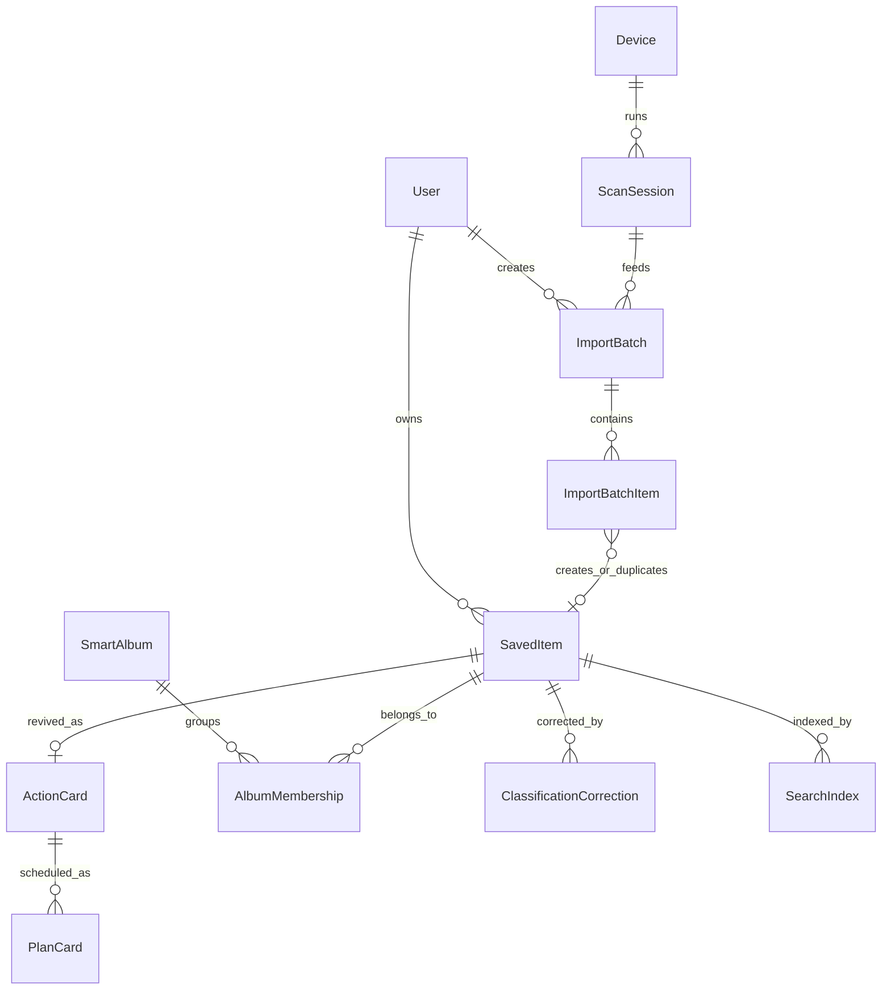

# 领域与数据模型规格

## 1. 建模原则

收藏复活系统的数据模型必须区分四类数据：

1. 原始数据：用户主动分享、扩展扫描到的可见文本、链接、标题、封面地址。
2. 派生数据：清洗标题、搜索索引、分类、摘要、关键词、实体、智能专辑候选。
3. 用户数据：备注、分类纠正、手动加入/移出专辑、计划状态、完成状态。
4. 系统元数据：schemaVersion、导入批次、扫描状态、同步队列、迁移记录。

原则是原始数据尽量保留，派生数据可以重算，用户手动数据不可被自动覆盖。当前代码已有 `APP_SCHEMA_VERSION = 3` 和 `STORAGE_KEY = collection-revival-system:v1`，后续迁移必须继续显式记录 schemaVersion。

## 2. SavedItem

当前状态：`packages/shared-types/src/index.ts` 已包含 SavedItem，并支持内容主题、收藏用途、置信度、证据、清洗标题和搜索字段。

目标字段：

```ts
SavedItem {
  id: string
  userId: string
  sourcePlatform: "xiaohongshu" | "manual" | "other"
  sourceUrl: string
  rawShareText: string
  visibleText?: string
  coverUrl?: string
  rawTitle?: string
  cleanedTitle?: string
  userEditedTitle?: string
  displayTitle: string
  textNormalizationVersion: number
  userNote: string

  contentDomain: ContentDomain
  contentSubDomain: string
  savedIntent: SavedIntent
  secondaryIntents: SavedIntent[]
  confidence: "high" | "medium" | "low"
  whyThisDomain: string
  whyThisIntent: string
  positiveEvidence: string[]
  negativeEvidence: string[]
  conflictingEvidence: string[]
  classificationShadow?: ClassificationShadowResult

  summary: string
  keywords: string[]
  entities: EntityTag[]
  searchableText: string
  status: ItemStatus
  createdAt: string
  updatedAt: string
}
```

状态机：

```text
indexed/not_started
  -> revived/action_card_created
  -> planned
  -> completed
  -> snoozed
```

当前代码仍使用 `ItemStatus` 的 `not_started/today/in_progress/completed/snoozed`，但产品语义目标应改为“已索引、已复活、已计划、已完成、已搁置”。可以先在展示层映射，数据层迁移到 V4 时再重命名。

## 3. ScanSession

当前状态：扩展内部使用 `chrome.storage.local` 保存 `revival-extension-scan-state` 和 checkpoint，Web 通过 bridge 同步扫描状态，但共享类型里还没有正式 `ScanSession`。

目标字段：

```ts
ScanSession {
  id: string
  userId?: string
  deviceId: string
  sourcePlatform: "xiaohongshu"
  pageUrl: string
  browser: "chrome" | "edge" | "other"
  extensionVersion: string
  selectorVersion: string
  status: "idle" | "scanning" | "paused" | "completed" | "blocked" | "error"
  stage: "detecting_page" | "scanning_visible" | "scrolling" | "deduping" | "ready_to_import" | "blocked"
  totalFound: number
  totalWithLink: number
  missingTitleCount: number
  missingLinkCount: number
  duplicateCount: number
  selectedCount: number
  noNewRounds: number
  lastAdded: number
  blockedReason?: "not_xhs" | "not_favorites" | "login_required" | "captcha" | "dom_changed" | "no_loaded_cards"
  startedAt: string
  updatedAt: string
  completedAt?: string
}
```

ScanSession 是浏览器扩展产品化后的显式模型。短期可以继续保留扩展 checkpoint，但 Web 的 ImportBatch 应引用 scanSessionId。

## 4. ImportBatch

当前状态：`ImportBatch` 和 `ImportBatchItem` 已存在，导入中心和扩展导入都进入统一管线；`createdActionCardCount` 当前应保持 0，符合按需生成原则。

目标字段补充：

```ts
ImportBatch {
  id: string
  source: ImportSource
  title: string
  status: ImportBatchStatus
  scanSessionId?: string
  rawCount: number
  importedCount: number
  duplicateCount: number
  failedCount: number
  createdActionCardCount: number
  createdAlbumCount: number
  scanSummary?: ScanSummary
  schemaVersion: number
  createdAt: string
  updatedAt: string
}
```

状态机：

```text
pending -> processing -> completed
                     -> partially_completed
                     -> failed
```

## 5. ImportBatchItem

当前状态：已能保存 sourceUrl、title、rawShareText、visibleText、coverUrl、status、duplicateOfSavedItemId、createdSavedItemId。

目标字段补充：

```ts
ImportBatchItem {
  id: string
  batchId: string
  scanSessionId?: string
  sourceUrl: string
  rawTitle?: string
  cleanedTitle?: string
  userEditedTitle?: string
  displayTitle?: string
  rawShareText: string
  visibleText?: string
  coverUrl?: string
  author?: string
  noteType?: "image" | "video" | "unknown"
  selectorVersion?: string
  status: "pending" | "imported" | "duplicate" | "failed" | "skipped"
  duplicateOfSavedItemId?: string
  createdSavedItemId?: string
  errorMessage?: string
  createdAt: string
}
```

ImportBatchItem 代表“这次导入中看到的一条原始候选”，SavedItem 代表“用户确认保存后的长期收藏索引”。

## 6. SmartAlbum

当前状态：SmartAlbum 已有 `albumView`、`contentDomain`、`savedIntent`、`recommendedItemIds`、`whyThisAlbum`、`whyStartHere`、`suggestedFirstAction`、`status`、确认/归档时间、自动收纳设置、matchProfile 和手动加入/移出字段。

目标语义：

- `albumView = content_domain`：主题专辑，回答“这些收藏讲的是什么”。
- `albumView = saved_intent`：用途专辑，回答“我当时为什么收藏它们”。

状态机：

```text
candidate -> confirmed -> archived
candidate -> archived
archived  -> candidate
archived  -> confirmed
```

确认后的规则：

- 高匹配新收藏自动加入 `savedItemIds`。
- 中匹配进入 `suggestedItemIds`。
- 低匹配不处理。
- `manuallyRemovedItemIds` 永远优先，不能被自动收纳重新加入。
- `manuallyAddedItemIds` 永远保留，不能被自动重算移除。

## 7. AlbumMembership

当前状态：成员关系在 SmartAlbum 数组字段里直接保存，适合 MVP，但长期不利于批量操作、撤销、同步冲突和历史记录。

目标独立模型：

```ts
AlbumMembership {
  id: string
  albumId: string
  savedItemId: string
  source: "auto_high" | "suggested_medium" | "manual_add" | "manual_remove"
  status: "active" | "suggested" | "removed"
  matchScore: number
  reason: string
  createdAt: string
  updatedAt: string
}
```

V1 可以继续数组存储，进入云同步前建议拆成独立表。

## 8. ClassificationCorrection

当前状态：`ClassificationCorrection` 已存在，详情和专辑页可记录人工修正，并支持撤销。

目标字段：

```ts
ClassificationCorrection {
  id: string
  savedItemId: string
  previousDomain: ContentDomain
  previousSubDomain: string
  previousIntent: SavedIntent
  correctedDomain: ContentDomain
  correctedSubDomain: string
  correctedIntent: SavedIntent
  tags: string[]
  textSnapshot: string
  reason?: string
  createdAt: string
}
```

分类纠正既是用户数据，也是未来 AI/规则评估集来源。它不能被批量迁移覆盖。

## 9. ActionCard

当前状态：ActionCard 已升级为按需生成，并包含 whySaved、openOriginalFocus、output、doneCriteria、avoidDoing、ifInfoMissing、followUp。

目标状态机：

```text
draft/generated -> active -> completed
                 -> archived
```

ActionCard 不应在 ImportBatch 中批量生成。它只在用户点击“复活这条”或“重新生成行动卡”时出现。

## 10. PlanCard

当前状态：PlanCard 已独立于重型 Plan，字段包含 sourceTitle、plannedDate、estimatedMinutes、oneNextStep、doneCriteria、status、completedAt、cancelledAt。

目标状态机：

```text
planned -> doing -> done
planned -> cancelled
doing   -> cancelled
planned -> planned (延期或改日期)
```

延期不复制新卡；取消不删除历史；完成更新今日统计和复活值。

## 11. SearchIndex

当前状态：SearchIndex 不是独立实体，`searchableText` 存在 SavedItem 内，`search-service` 运行时合并 ActionCard 和 SmartAlbum 字段。

目标字段：

```ts
SearchIndex {
  id: string
  savedItemId: string
  documentText: string
  titleText: string
  keywordText: string
  entityText: string
  albumText: string
  actionCardText?: string
  updatedAt: string
  schemaVersion: number
}
```

V1 IndexedDB 阶段可先保留内联 searchableText，但每次标题、分类、专辑、行动卡或备注变更后必须重新生成索引。

## 12. User、Device、SyncQueue

当前状态：只有 `DEFAULT_USER`，没有真实登录。`storage-service` 有 SupabaseAdapter 占位，但会主动抛错，避免假云同步。

目标：

```ts
User {
  id: string
  email?: string
  name?: string
  createdAt: string
}

Device {
  id: string
  userId: string
  platform: "web" | "extension" | "ios" | "android"
  name: string
  lastSeenAt: string
}

SyncQueue {
  id: string
  userId: string
  entityType: string
  entityId: string
  operation: "create" | "update" | "delete"
  payload: unknown
  status: "pending" | "syncing" | "synced" | "failed" | "conflict"
  createdAt: string
  updatedAt: string
}
```

云同步必须等 Supabase URL、anon key、Auth 和 RLS 策略齐全后再启用。

## 13. 实体关系



## 14. 字段来源

- 用户输入：userNote、userEditedTitle、手动分类、计划日期、完成状态。
- 平台可见数据：sourceUrl、rawTitle、visibleText、coverUrl、author、noteType。
- AI/规则派生：contentDomain、savedIntent、summary、keywords、entities、SmartAlbum。
- 系统派生：displayTitle、cleanedTitle、searchableText、dedupeKey、priorityScore。

迁移时先保存备份，再修改派生字段；用户输入字段不自动覆盖。

## 15. 迁移与回滚原则

1. 所有迁移函数输入旧状态，输出新状态和 report。
2. report 必须包含 checked、changed、skipped、ambiguous、errors。
3. UI 先预览，再应用。
4. 应用前导出 JSON 备份。
5. 应用后支持撤销最近一次迁移。
6. 迁移不自动运行在用户生产数据上，除非是只读 normalize 且不会改变用户可见字段。
