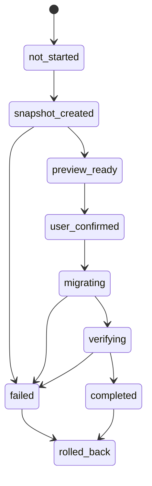

# IndexedDB 零丢失迁移流程

## Task 5 实施更新：迁移预览与验证器

Task 5 已在 `packages/storage-service/src/migration-preview.ts` 落地为纯只读能力，输入是 Task 4 生成的 `LegacyBackupEnvelope`。它不会调用 `loadAppState`，不会读取真实浏览器 `localStorage`，不会打开或写入正式 IndexedDB，也不会修改 `activeStorage`。这一层只回答一个问题：这份旧数据是否可以安全进入后续迁移执行。

新增的核心 API：

- `validateMigrationSource(envelope)`：校验 envelope、raw backup、normalized Snapshot、checksum 和基础版本。
- `createMigrationPreview(envelope, options)`：生成结构化 `MigrationPreviewReport`、`MigrationPlan`、issue 列表、重复组、断裂引用和数据保留检查。
- `createMigrationPreviewUserSummary(report)`：把技术预览转换成后续设置页可展示的用户摘要。
- `createMigrationReport(report)`：把 preview 压缩成可保存、可导出的迁移报告摘要。

Task 5 的 issue 分为 `blocking`、`warning` 和 `info`。`blocking` 会阻止进入 Task 6 迁移执行，例如 checksum 不一致、缺 normalized Snapshot、重复主键、必需引用断裂、用户备注/手动标题/sourceUrl/分类纠正未保留。`warning` 需要用户确认，例如同源重复、可选引用断裂、目标库同编号冲突、已归档/已确认专辑状态或计划状态异常。`info` 只说明预期行为，例如搜索索引会重建、内部测试 key 默认排除、目标库已有完全相同记录会跳过。

`MigrationPlan` 只生成计划，不执行写入。每条记录的操作会被标记为 `create`、`skip`、`conflict` 或 `manual_review`；Task 5 不使用 `update` 覆盖目标记录。目标 `StorageAdapter` 如果传入，只会被 `getAll` 只读比较，用来识别目标空库、完全相同记录和同主键冲突。任何目标读取失败都会变成手动确认 issue，而不是继续假装可迁移。

Task 5 明确不做这些事：不执行 migration state machine，不创建 writer lock，不做断点恢复，不写 `migrationMetadata`，不下载备份，不显示 UI，不自动修复旧扫描文本，不重新分类，不重新生成 SmartAlbum、ActionCard 或 PlanCard。Task 6 才能消费 `MigrationPlan` 执行 staging 写入、迁移锁、断点恢复、校验后切换和回滚。

## Task 4 实施更新：备份输入阶段

Task 4 已补齐迁移流程的“只读输入”能力，但仍未开始迁移。迁移状态机里的 `snapshot_created` 现在应理解为：通过 `LegacyLocalStorageSnapshotReader` 读取显式 allowlist key，生成 `LegacyBackupEnvelope`，其中同时包含 raw backup、可选 normalized `StorageSnapshot`、SHA-256 checksum 和结构化 read report。

这一阶段的约束如下：

- 不调用 `loadAppState`，因为它在主 key 缺失或 JSON 解析失败时会写入 demo 数据。
- 不自动修复旧扫描文本，不重新分类，不重新生成专辑、行动卡或计划卡。
- 不写 IndexedDB，不写 localStorage，不写 `backups` store，也不修改 `activeStorage`。
- raw backup 即使 AppState JSON 损坏也能生成；normalized Snapshot 只有在 AppState 可解析且基础结构可映射时才存在。
- checksum 分 raw 与 normalized 两类，使用 canonical JSON 和 Web Crypto SHA-256；checksum 不可用时保留 backup，并记录 warning。
- unknown localStorage key 只记录 key 名，不读取 value；敏感 key 永远排除。
- 扩展 `chrome.storage.local` 的 scan checkpoint、progress、bridge state 不进入 Web backup。

Task 5 会消费 Task 4 的 raw backup 和 normalized Snapshot，完成迁移预览与验证器，包括引用完整性、重复处理、迁移可执行性、blocking error / warning 分级和 MigrationReport。Task 6 才执行真实写入、断点恢复、迁移锁和回滚；Task 7 才把导出按钮和迁移入口接入设置页 UI。

迁移的首要原则是：不能在用户打开页面时静默执行，不能删除旧 localStorage，不能覆盖用户手动整理结果。Phase 1 迁移只负责把当前浏览器里的 Web 数据从 localStorage 安全搬到 IndexedDB，并为失败回滚提供证据链。扩展断点仍留在 `chrome.storage.local`，文本修复仍是独立操作。

## 迁移状态机



| 状态 | 含义 |
|---|---|
| `not_started` | 用户尚未开始升级。 |
| `snapshot_created` | 已读取 raw localStorage，并创建不可变快照。 |
| `preview_ready` | 已解析快照，生成迁移预览和风险提示。 |
| `user_confirmed` | 用户主动点击开始升级。 |
| `migrating` | 正在写入 IndexedDB staging 数据。 |
| `verifying` | 正在校验计数、引用、去重和 checksum。 |
| `completed` | 校验通过，activeStorage 已切换到 IndexedDB。 |
| `failed` | 任一阶段失败，禁止切换 activeStorage。 |
| `rolled_back` | 已回到 localStorage 读取模式，IndexedDB staging 数据保留供排查或被安全清理。 |

## 完整流程

1. 检测 localStorage 数据版本和分散 key。
2. 直接读取 raw strings，不调用会自动写 demo 的 `loadAppState`。
3. 计算待迁移实体数量，包括主 AppState、主题、成就、真实试用记录。
4. 创建不可变备份快照，写入 `backups` store；如果 IndexedDB 还不可用，先提供 JSON 下载。
5. 对快照生成 checksum，记录 sourceSchemaVersion、app build hash、创建时间。
6. 向用户展示迁移预览：收藏、批次、批次明细、专辑、行动卡、计划卡、分类纠正、成就、真实试用记录。
7. 用户主动确认后，创建迁移锁，禁止导入、复活、专辑确认、计划更新等写操作。
8. 写入 IndexedDB staging stores。建议使用临时 database 或每条记录带 `migrationId`，验证通过后再激活。
9. 校验实体数量、主键唯一性、引用完整性、URL 去重、SmartAlbum 成员引用、ActionCard -> SavedItem、PlanCard -> ActionCard / SavedItem、ClassificationCorrection -> SavedItem。
10. 校验 checksumAfter 和抽样内容，确认中文、Emoji、数组、日期字段没有被错误序列化。
11. 校验通过后写入 `migrationMetadata.current`，更新 localStorage 小 key `collection-revival-active-storage = indexedDB`。
12. 释放迁移锁，恢复写操作。
13. 保留 localStorage 原始数据，不立即删除。
14. 经过稳定观察期后，才允许用户在设置页手动清理旧数据。
15. 如果任何一步失败，阻止切换 IndexedDB，并回到 LocalStorageAdapter。

## MigrationReport

```ts
interface MigrationReport {
  id: string;
  status: "not_started" | "snapshot_created" | "preview_ready" | "user_confirmed" | "migrating" | "verifying" | "completed" | "failed" | "rolled_back";
  sourceSchemaVersion: string;
  targetSchemaVersion: string;
  startedAt: string;
  completedAt?: string;
  sourceCounts: Record<string, number>;
  targetCounts: Record<string, number>;
  skippedCounts: Record<string, number>;
  duplicateCounts: Record<string, number>;
  brokenReferences: Array<{ type: string; id: string; field: string; targetId: string }>;
  warnings: string[];
  checksumBefore: string;
  checksumAfter?: string;
  rollbackAvailable: boolean;
}
```

## 必须验证的内容

1. SavedItem 数量一致。
2. ImportBatch 数量一致。
3. ImportBatchItem 数量一致。
4. SmartAlbum 引用的 SavedItem 全部存在。
5. ActionCard 引用的 SavedItem 存在。
6. PlanCard 引用的 SavedItem / ActionCard 存在；缺 ActionCard 时记录 warning，不静默丢 PlanCard。
7. ClassificationCorrection 引用的 SavedItem 存在。
8. 用户备注不丢失。
9. 用户编辑标题不丢失。
10. sourceUrl、normalizedSourceUrl、无 URL 手动收藏状态都不丢失。
11. 扩展导入来源字段、visibleText、coverUrl、scanSummary 不丢失。
12. 日期字段能恢复为 ISO string，不能变成 Date object 或 undefined。
13. 集合和数组不被错误序列化，尤其 `keywords`、`entities`、`savedItemIds`、`recommendedItemIds`、`suggestedItemIds`。
14. Emoji、中文、特殊符号正常。
15. 已归档、已确认、低置信、已完成、已取消等状态保持。
16. 成就解锁时间保持。
17. 真实试用记录如果迁移，评价字段和 issueNote 保持。

如果以上任一核心校验失败，必须阻止切换 IndexedDB。

## 多标签页与写入锁

Phase 1 建议增加迁移锁设计，但不要依赖服务器：

- localStorage 小 key：`collection-revival-migration-lock`，包含 `ownerTabId`、`startedAt`、`expiresAt`、`migrationId`。
- BroadcastChannel：`collection-revival-storage-events`，通知其他标签页进入只读状态。
- 锁过期：如果页面崩溃，超过固定时间后允许用户手动接管，但必须先重新读取 snapshot。

迁移期间：

- 禁止手动导入、扩展导入、生成行动卡、确认专辑、计划卡更新。
- 搜索和查看详情可继续只读。
- 如果扩展向 Web 发送导入 payload，Web 应提示“正在升级本地存储，请稍后再导入”，不缓存半成品写入。

## 迁移 UI 设计

入口：设置 -> 数据管理 -> 升级本地数据存储。

### 状态一：尚未升级

文案：

> 为了支持几千条收藏和更稳定的搜索，需要把本地数据升级到新的存储方式。升级前会自动创建备份，不会删除现有数据。

按钮：

- 查看升级内容
- 暂不升级

### 状态二：迁移预览

显示：

- 收藏 X 条
- 扫描批次 X 个
- 批次明细 X 条
- 智能专辑 X 个
- 行动卡 X 张
- 计划卡 X 张
- 分类纠正 X 条
- 成就 X 个
- 真实试用记录 X 条
- 预计处理时间
- 风险提示和 warnings

按钮：

- 导出备份
- 开始升级
- 取消

### 状态三：迁移中

显示阶段：

1. 创建备份
2. 写入收藏
3. 写入批次
4. 写入专辑
5. 写入行动卡和计划卡
6. 写入设置和成就
7. 校验引用
8. 完成切换

禁止只有一个无限 loading。每个阶段都要显示当前进度和可读状态。

### 状态四：完成

文案：

> 本地数据升级完成。旧数据仍保留在浏览器中，确认稳定后你可以手动清理。

按钮：

- 查看迁移报告
- 导出迁移报告
- 保留旧备份
- 恢复旧版本

## 回滚方案

回滚分两种：

1. **迁移失败自动回滚**：activeStorage 不切换，继续使用 localStorage；IndexedDB staging 数据保留在 `migrationMetadata` 标记下，等待用户导出报告或清理。
2. **迁移完成后用户手动回滚**：将 `collection-revival-active-storage` 改回 `localStorage`，保留 IndexedDB 数据，不删除；如果用户选择恢复某个 backup，则先预览 backup，再覆盖当前 active IndexedDB 或恢复 localStorage。

回滚不能做的事：

- 不能自动清空 localStorage。
- 不能用 demo 数据覆盖损坏数据。
- 不能丢弃已生成的 MigrationReport。
- 不能在没有用户确认的情况下清理 IndexedDB。

## 文本修复与迁移分离

旧扫描文本修复是数据质量操作，存储迁移是数据位置操作。Phase 1 迁移只搬运已有字段并校验，不自动运行 `migrateScannedTextV3` 或任何标题清洗修复。用户可以在迁移完成后单独进入“修复旧扫描文本”预览，导出备份并手动应用。
## Task 3 补充：staging import 只是底层验证，不等于真实迁移

Task 3 的 `IndexedDbAdapter.importSnapshot({ mode: "staging" })` 已实现为底层 adapter 能力测试：先用 `MemoryAdapter` 验证 Snapshot 结构和导入语义，验证成功后再用一个 IndexedDB 多 store readwrite transaction 写入目标 stores。这个 staging 行为能证明“验证失败不会污染主数据库、写入失败会由原生 transaction 回滚”，但它还不是用户可见的数据迁移流程。

真实迁移仍然需要后续 Task 4-6 完成以下内容：raw localStorage snapshot、不可变备份、checksum、MigrationReport、引用完整性验证、用户确认 UI、多标签 writer lock、activeStorage 切换、失败恢复和用户可理解的回滚入口。Task 3 没有读取 localStorage，没有写 `migrationMetadata` 状态机，没有修改 `collection-revival-active-storage`，也没有删除或清理任何旧数据。

## Task 6 补充：执行、断点恢复和回滚的当前落地

Task 6 已把迁移状态机中的执行段落落到 `packages/storage-service/src/migration-executor.ts`。当前实现仍然是库能力，不会在 Web 页面打开时运行，也不会切换 `activeStorage`。调用方必须先通过 Task 4 创建 `LegacyBackupEnvelope`，再通过 Task 5 创建可执行的 `MigrationPreviewReport/MigrationPlan`，最后显式传入 `userConfirmed = true` 才能执行。

执行流程现在拆成几个可恢复阶段：获取单写入者锁、检查 target adapter、校验 plan/envelope/checksum、检查目标业务 stores 为空、用 MemoryAdapter 做 staging 校验、写入 `backups`、写入 `migrationMetadata` checkpoint、按固定顺序写入业务 stores、逐 store 验证数量和 checksum、最终全量验证并标记 completed。固定顺序为 `settings -> savedItems -> importBatches -> importBatchItems -> smartAlbums -> actionCards -> planCards -> classificationCorrections -> searchLogs`，`migrationMetadata` 和 `backups` 只保存执行证据，不作为业务数据迁移目标。

断点恢复基于 `migrationMetadata` 中的 store checkpoint。已验证的 store 会重新比对 checksum；写入后失败但 checksum 匹配的 store 会被标记为 verified；pending 或 failed store 会继续写入。如果目标 store 中存在与 checkpoint 不一致的数据，恢复会以 `MIGRATION_RESUME_CONFLICT` 停止，避免覆盖用户或测试过程中出现的未知写入。

回滚只在 `activeStorageSwitched = false` 时允许。它按业务 store 逆序清空本次迁移写入的数据，并保留 `backups` 与 `migrationMetadata`，方便后续导出报告或人工排查。回滚不是删除旧 localStorage，也不是把 IndexedDB 切回 localStorage；真正的 activeStorage 标识切换和设置页恢复入口仍留到后续 Task。

单写入者锁当前提供两个实现：`MemoryMigrationLockProvider` 用于单元测试和库级验证，`WebLocksMigrationLockProvider` 用于后续浏览器环境接入时的独占语义。Task 6 没有实现 localStorage 锁、BroadcastChannel UI 通知或多标签页设置页锁定，这些属于接入层任务。
## Task 6.1 Hardened Execution Flow

Task 6.1 keeps execution as a library capability only. It still does not run on page load, does not read real user localStorage by itself, does not mutate legacy localStorage, and does not switch `activeStorage`.

The execution order is now locked to:

1. Acquire the migration writer lock.
2. Open and health-check the explicit target adapter.
3. Compare target schemaVersion across preview, plan, expected option, and actual adapter.
4. Scan all `migrationMetadata` and block if another unresolved migration exists.
5. Confirm target business stores are empty.
6. Validate the normalized snapshot through staging.
7. Strictly verify the legacy backup envelope.
8. Serialize the envelope and compute SHA-256.
9. Create or reuse an immutable backup in a single `backups` readwrite transaction.
10. Read the backup back, recompute SHA-256, parse it, and verify the parsed envelope.
11. Mark backup `verifiedAt`.
12. Write execution metadata.
13. Write business stores in fixed order.
14. Verify each store by count and SHA-256.
15. Run final semantic verification for references and user-preserved fields.
16. Run final physical verification.
17. Mark completed without switching `activeStorage`.

Resume rereads the persisted backup, verifies immutable fields, byte length, serialized envelope SHA-256, parsed envelope, and source checksum alignment before continuing from checkpoints. Rollback can be retried after `rollback_failed`; already-cleared stores remain empty, remaining stores continue clearing, and backup/metadata are retained.

Task 7B must use Web Locks for IndexedDB. If Web Locks are unavailable, the UI must block migration instead of falling back to memory or localStorage locks.
