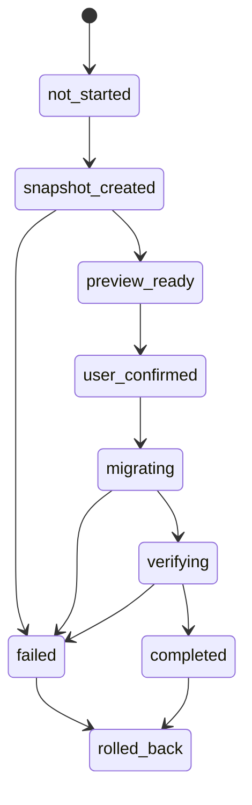

# IndexedDB 零丢失迁移流程

迁移的首要原则是：不能在用户打开页面时静默执行，不能删除旧 localStorage，不能覆盖用户手动整理结果。Phase 1 迁移只负责把当前浏览器里的 Web 数据从 localStorage 安全搬到 IndexedDB，并为失败回滚提供证据链。扩展断点仍留在 `chrome.storage.local`，文本修复仍是独立操作。

## 迁移状态机



| 状态 | 含义 |
|---|---|
| `not_started` | 用户尚未开始升级。 |
| `snapshot_created` | 已读取 raw localStorage，并创建不可变快照。 |
| `preview_ready` | 已解析快照，生成迁移预览和风险提示。 |
| `user_confirmed` | 用户主动点击开始升级。 |
| `migrating` | 正在写入 IndexedDB staging 数据。 |
| `verifying` | 正在校验计数、引用、去重和 checksum。 |
| `completed` | 校验通过，activeStorage 已切换到 IndexedDB。 |
| `failed` | 任一阶段失败，禁止切换 activeStorage。 |
| `rolled_back` | 已回到 localStorage 读取模式，IndexedDB staging 数据保留供排查或被安全清理。 |

## 完整流程

1. 检测 localStorage 数据版本和分散 key。
2. 直接读取 raw strings，不调用会自动写 demo 的 `loadAppState`。
3. 计算待迁移实体数量，包括主 AppState、主题、成就、真实试用记录。
4. 创建不可变备份快照，写入 `backups` store；如果 IndexedDB 还不可用，先提供 JSON 下载。
5. 对快照生成 checksum，记录 sourceSchemaVersion、app build hash、创建时间。
6. 向用户展示迁移预览：收藏、批次、批次明细、专辑、行动卡、计划卡、分类纠正、成就、真实试用记录。
7. 用户主动确认后，创建迁移锁，禁止导入、复活、专辑确认、计划更新等写操作。
8. 写入 IndexedDB staging stores。建议使用临时 database 或每条记录带 `migrationId`，验证通过后再激活。
9. 校验实体数量、主键唯一性、引用完整性、URL 去重、SmartAlbum 成员引用、ActionCard -> SavedItem、PlanCard -> ActionCard / SavedItem、ClassificationCorrection -> SavedItem。
10. 校验 checksumAfter 和抽样内容，确认中文、Emoji、数组、日期字段没有被错误序列化。
11. 校验通过后写入 `migrationMetadata.current`，更新 localStorage 小 key `collection-revival-active-storage = indexedDB`。
12. 释放迁移锁，恢复写操作。
13. 保留 localStorage 原始数据，不立即删除。
14. 经过稳定观察期后，才允许用户在设置页手动清理旧数据。
15. 如果任何一步失败，阻止切换 IndexedDB，并回到 LocalStorageAdapter。

## MigrationReport

```ts
interface MigrationReport {
  id: string;
  status: "not_started" | "snapshot_created" | "preview_ready" | "user_confirmed" | "migrating" | "verifying" | "completed" | "failed" | "rolled_back";
  sourceSchemaVersion: string;
  targetSchemaVersion: string;
  startedAt: string;
  completedAt?: string;
  sourceCounts: Record<string, number>;
  targetCounts: Record<string, number>;
  skippedCounts: Record<string, number>;
  duplicateCounts: Record<string, number>;
  brokenReferences: Array<{ type: string; id: string; field: string; targetId: string }>;
  warnings: string[];
  checksumBefore: string;
  checksumAfter?: string;
  rollbackAvailable: boolean;
}
```

## 必须验证的内容

1. SavedItem 数量一致。
2. ImportBatch 数量一致。
3. ImportBatchItem 数量一致。
4. SmartAlbum 引用的 SavedItem 全部存在。
5. ActionCard 引用的 SavedItem 存在。
6. PlanCard 引用的 SavedItem / ActionCard 存在；缺 ActionCard 时记录 warning，不静默丢 PlanCard。
7. ClassificationCorrection 引用的 SavedItem 存在。
8. 用户备注不丢失。
9. 用户编辑标题不丢失。
10. sourceUrl、normalizedSourceUrl、无 URL 手动收藏状态都不丢失。
11. 扩展导入来源字段、visibleText、coverUrl、scanSummary 不丢失。
12. 日期字段能恢复为 ISO string，不能变成 Date object 或 undefined。
13. 集合和数组不被错误序列化，尤其 `keywords`、`entities`、`savedItemIds`、`recommendedItemIds`、`suggestedItemIds`。
14. Emoji、中文、特殊符号正常。
15. 已归档、已确认、低置信、已完成、已取消等状态保持。
16. 成就解锁时间保持。
17. 真实试用记录如果迁移，评价字段和 issueNote 保持。

如果以上任一核心校验失败，必须阻止切换 IndexedDB。

## 多标签页与写入锁

Phase 1 建议增加迁移锁设计，但不要依赖服务器：

- localStorage 小 key：`collection-revival-migration-lock`，包含 `ownerTabId`、`startedAt`、`expiresAt`、`migrationId`。
- BroadcastChannel：`collection-revival-storage-events`，通知其他标签页进入只读状态。
- 锁过期：如果页面崩溃，超过固定时间后允许用户手动接管，但必须先重新读取 snapshot。

迁移期间：

- 禁止手动导入、扩展导入、生成行动卡、确认专辑、计划卡更新。
- 搜索和查看详情可继续只读。
- 如果扩展向 Web 发送导入 payload，Web 应提示“正在升级本地存储，请稍后再导入”，不缓存半成品写入。

## 迁移 UI 设计

入口：设置 -> 数据管理 -> 升级本地数据存储。

### 状态一：尚未升级

文案：

> 为了支持几千条收藏和更稳定的搜索，需要把本地数据升级到新的存储方式。升级前会自动创建备份，不会删除现有数据。

按钮：

- 查看升级内容
- 暂不升级

### 状态二：迁移预览

显示：

- 收藏 X 条
- 扫描批次 X 个
- 批次明细 X 条
- 智能专辑 X 个
- 行动卡 X 张
- 计划卡 X 张
- 分类纠正 X 条
- 成就 X 个
- 真实试用记录 X 条
- 预计处理时间
- 风险提示和 warnings

按钮：

- 导出备份
- 开始升级
- 取消

### 状态三：迁移中

显示阶段：

1. 创建备份
2. 写入收藏
3. 写入批次
4. 写入专辑
5. 写入行动卡和计划卡
6. 写入设置和成就
7. 校验引用
8. 完成切换

禁止只有一个无限 loading。每个阶段都要显示当前进度和可读状态。

### 状态四：完成

文案：

> 本地数据升级完成。旧数据仍保留在浏览器中，确认稳定后你可以手动清理。

按钮：

- 查看迁移报告
- 导出迁移报告
- 保留旧备份
- 恢复旧版本

## 回滚方案

回滚分两种：

1. **迁移失败自动回滚**：activeStorage 不切换，继续使用 localStorage；IndexedDB staging 数据保留在 `migrationMetadata` 标记下，等待用户导出报告或清理。
2. **迁移完成后用户手动回滚**：将 `collection-revival-active-storage` 改回 `localStorage`，保留 IndexedDB 数据，不删除；如果用户选择恢复某个 backup，则先预览 backup，再覆盖当前 active IndexedDB 或恢复 localStorage。

回滚不能做的事：

- 不能自动清空 localStorage。
- 不能用 demo 数据覆盖损坏数据。
- 不能丢弃已生成的 MigrationReport。
- 不能在没有用户确认的情况下清理 IndexedDB。

## 文本修复与迁移分离

旧扫描文本修复是数据质量操作，存储迁移是数据位置操作。Phase 1 迁移只搬运已有字段并校验，不自动运行 `migrateScannedTextV3` 或任何标题清洗修复。用户可以在迁移完成后单独进入“修复旧扫描文本”预览，导出备份并手动应用。
