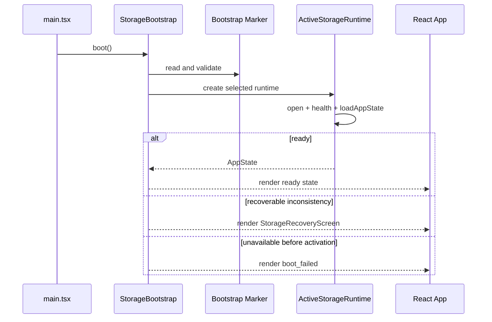

# Runtime Storage Architecture

## Task 8A 已落地基线

Task 8A 已新增独立的 `@revival/storage-runtime` 包，并把 `LocalStorageRuntime` 接入 Web 异步启动门。当前唯一权威来源仍为 localStorage，普通业务页面只有在 Runtime 完成 `open -> healthCheck -> loadAppState` 后才渲染。实际契约、生命周期和测试结果以 `docs/TASK8A_ACCEPTANCE.md` 为准。

这一实现没有创建 Bootstrap Marker、IndexedDbRuntime 或 activeStorage 选择器。直接访问 `/settings/data-migration` 仍走 Task 7 的只读入口，避免损坏主 AppState 时失去原始备份能力。主题和成就由 Runtime 的产品设置接口管理；developerMode、QA、真实试用和扩展状态继续留在边界外。

后续 Task 8B 必须复用同一 Runtime 契约完成 IndexedDB 的 AppState 等价性，但仍不得切换运行时。下文包含面向 Task 8B 至 8D 的目标设计，其中 Marker、authority revision、实体 diff 和原子多 Store 写入均属于后续能力，不应误读为 Task 8A 已实现。

## 1. 决策

Phase 1 采用过渡 Runtime 方案：UI 暂时继续消费完整 `AppState`，Runtime 负责异步启动、单一权威源、差异持久化和错误阻断；后续再按业务模块迁移到 Repository。

不选择“每次把完整 AppState 拆分并全量写入所有 Store”，因为它保留了当前几千条数据下的全量序列化和大事务问题。不在 Task 8 一次性把所有页面改成 Repository，因为 App.tsx 约有 30 组状态写动作，直接重写会把存储切换与产品逻辑重构绑定在一起，难以证明没有漏写。

## 2. 建议接口

```ts
type RuntimeKind = "localStorage" | "indexedDB";

type RuntimeBootResult =
  | { status: "ready"; state: AppState; runtime: ActiveStorageRuntime }
  | { status: "recovery_required"; reason: RuntimeBootErrorCode }
  | { status: "boot_failed"; reason: RuntimeBootErrorCode };

interface ActiveStorageRuntime {
  readonly kind: RuntimeKind;
  readonly authorityRevision: number;

  open(): Promise<void>;
  close(): Promise<void>;
  healthCheck(level: "available" | "readable" | "writable" | "integrity"): Promise<RuntimeHealthReport>;
  loadAppState(signal?: AbortSignal): Promise<AppState>;
  applyAppStateChange(change: AppStateChange, signal?: AbortSignal): Promise<AppState>;
  exportSnapshot(): Promise<StorageSnapshot>;
}

type AppStateChange =
  | { kind: "replace"; previous: AppState; next: AppState; reason: string }
  | { kind: "entities"; previous: AppState; next: AppState; changedStores: StorageEntityName[]; reason: string };
```

Runtime 不直接暴露 React hook、toast 或路由。Web 层的 `RuntimeAppStateController` 串行处理更新：读取当前内存 state，生成 next，先通过 Runtime 原子持久化，再提交 React state。持久化失败时不提交“成功”内存状态，并进入可恢复错误 UI。

## 3. 启动边界



Web 增加单一启动状态：

- `booting`：只显示启动壳，不渲染空 AppState，不允许业务操作。
- `ready`：Runtime 已打开且 AppState 已通过基本校验。
- `recovery_required`：Marker、Journal、Metadata 或目标数据冲突。
- `boot_failed`：当前权威后端不可用，但尚不能安全恢复。

禁止先渲染 `createInitialDemoData()` 再异步覆盖。启动请求使用 generation id 或 AbortController，过期结果不得提交。StrictMode 的重复调用由单例 boot promise 或幂等 bootstrap controller 合并，但该 controller 只在 Web composition root 生命周期内存在，不是跨标签页全局单例。

## 4. LocalStorageRuntime

Task 8A 先实现 LocalStorageRuntime，默认仍选择它：

- 读取 `collection-revival-system:v1`、theme、achievements。
- 使用现有 normalize 纯函数维持兼容。
- 主 key 缺失时保留当前首次使用策略，但必须明确区分真正新用户与已有迁移证据。
- JSON 损坏时不得写 demo 覆盖；返回 `recovery_required` 并允许 raw backup。
- 写入仍为单次完整 AppState JSON，但通过 Runtime 捕获 quota、serialize 和 setItem 失败。
- 每次业务写前校验 Bootstrap Marker revision 和 backend，防止旧标签页继续写。
- Task 8A 不创建 Marker；Marker 缺失等价 `legacy_active`。

旧 `packages/database.loadAppState/persistAppState` 不再由页面调用，只能被 LocalStorageRuntime 的 legacy codec 包装。旧 LocalStorageAdapter 不宣称具备通用事务能力。

## 5. IndexedDbRuntime hydrate

IndexedDbRuntime 打开 schema v1 后，在一个 readonly 多 Store transaction 中读取九个业务 Store和必要 settings。hydrate 顺序：

1. 读取 `app.user`、`app.schemaVersion` 和所有 order manifest。
2. 读取九个业务 Store。
3. 按 manifest 恢复数组；manifest 缺少 id 时阻断，额外 id 作为完整性错误处理。
4. 验证 SavedItem、Album、ActionCard、PlanCard、Correction 引用。
5. 不重新分类、不修复文本、不重新生成专辑或行动卡。
6. 在内存中重建筛选、搜索结果和统计等派生视图。

若老数据没有 order manifest 或 `app.user`，Runtime 不猜测排序，也不默默使用 DEFAULT_USER。激活前必须重新迁移或完成可验证的 metadata preparation。

## 6. IndexedDbRuntime 写入

过渡 Runtime 对 `previous` 与 `next` 做按 Store 的 id-based diff：

- 新增/更新记录用 `put`。
- 删除记录用 `delete`。
- 数组顺序变化更新对应 order manifest。
- theme、achievements、user 和 schema 更新 settings。
- 同一业务动作影响多个 Store 时使用一个 readwrite transaction。

典型多 Store transaction：

| 动作 | Store |
|---|---|
| 扩展/手动导入 | savedItems、importBatches、importBatchItems、smartAlbums、settings(order) |
| 复活并生成行动卡 | savedItems、actionCards、settings(order) |
| 加入计划 | actionCards、planCards、savedItems、settings(order) |
| 完成/取消计划 | planCards、savedItems，必要时 achievements/settings |
| 分类纠正 | savedItems、classificationCorrections、smartAlbums、settings(order) |
| 专辑批量移动 | smartAlbums、savedItems、settings(order) |
| 文本迁移应用/撤销 | savedItems、importBatchItems、smartAlbums，使用单事务 |

Runtime 写入完成前 React 不显示最终成功状态。UI 可显示短暂 pending；失败后保留 previous state，给出安全重试或恢复入口。

## 7. Repository 边界

Task 8 的目标不是把 Adapter 暴露给页面。分层如下：

```text
React 页面
  -> RuntimeAppStateController（更新排队、内存提交、错误状态）
  -> ActiveStorageRuntime（权威选择、hydrate、diff、事务）
  -> Repository（逐步接管业务语义）
  -> StorageAdapter（通用 CRUD、query、transaction、snapshot）
  -> localStorage / IndexedDB
```

Task 8A/8B 允许 Runtime 直接通过 Adapter 完成通用 diff；后续每个业务模块迁移到 Repository 后，Runtime 仍负责启动和权威后端，不重复实现专辑、计划或分类语义。

## 8. 单一权威源

任一时刻只有一个可写后端：

- Marker 缺失或 `legacy_active`：LocalStorageRuntime 可写，IndexedDB 仅迁移/验证用途。
- `activation_prepared` 或 `activating`：业务写冻结，两边都不可作为普通业务 writer。
- `indexeddb_active` 且 Journal committed：IndexedDbRuntime 可写，旧业务 localStorage 只读。
- `recovery_required`：普通业务写全部阻断。

禁止双写、失败后写另一个后端、后台自动合并以及“先更新内存再祈祷 effect 成功”。

## 9. healthCheck 层级

1. `available`：API 和 backend 存在。
2. `readable`：可打开并读取 schema/runtime metadata。
3. `writable`：仅在可回滚临时事务中验证，不污染业务记录。
4. `integrity`：AppState hydrate、引用、order manifest、Migration final checksum 和 Journal 一致。

启动至少要求 readable；激活 commit 要求 integrity；普通写失败后重新检查 writable。healthCheck 不清空数据，也不触发 fallback。

## 10. 异常处理

- `QuotaExceededError`：当前动作失败，内存不提交，保持同一权威源。
- `versionchange`：关闭旧连接，进入 stale runtime，提示刷新。
- `blocked`：显示其他标签页占用，不创建第二 writer。
- transaction abort：整个业务动作失败并回到 previous state。
- IndexedDB active 后 open 失败：进入 Recovery Screen，不写 localStorage。
- Web Locks 不可用：禁止激活；已经 active 的单标签页读取可继续，但写入策略必须进入受限模式并要求支持的浏览器。
- Web Crypto 不可用：禁止漂移和激活完整性检查。

## 11. 延后能力

- 独立全文 SearchIndex Store。
- AlbumMembership 正式实体。
- Supabase、登录、云同步和冲突解决。
- 手机 App Runtime。
- 自动清理旧 localStorage。
- committed 后的自动反向迁移。

## Task 8B: IndexedDbRuntime

IndexedDbRuntime 使用显式注入的 IndexedDbAdapter，构造时零存储访问，`open()` 后严格检查 schemaVersion 1。Runtime 通过 `runtime:app-metadata:v1` 保存 user/App schema，通过 `runtime:order-manifest:v1` 保存八组 AppState 数组顺序；hydrate 不依赖 getAll 顺序。实体 diff 接近 O(n)，一次多 Store readwrite transaction 原子提交 create/update/delete 和 metadata/manifest，随后进行只读 change-set 校验。失败不回退 localStorage。Web 默认 Runtime 在 Task 8C 前仍为 LocalStorageRuntime。