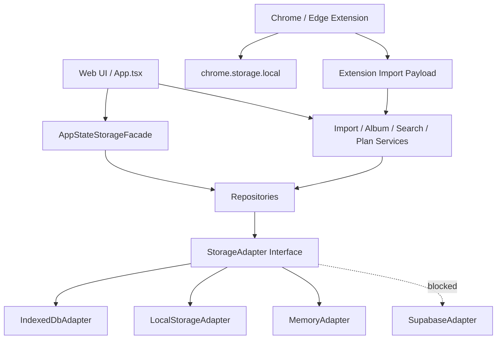

# Storage Adapter 设计

当前 `packages/storage-service` 已经有 `StorageAdapter`、`LocalStorageAdapter` 和被阻塞的 `SupabaseAdapter`，但它仍然是按实体方法封装，并且底层继续读写一个整体 AppState JSON。Phase 1 需要把它升级成真正的本地数据访问层，同时避免一轮内重写所有页面和业务 service。

设计目标是：UI 不再直接调用 localStorage；页面通过 repository / service 层访问数据；旧 localStorage 只作为迁移源和回滚源；IndexedDB 成为 Phase 1 主存储；Supabase 继续占位，直到真实项目、Auth 和 RLS 都准备好。

## 设计原则

1. **先兼容，再拆细**：第一步可以提供 AppState 形状的兼容读写，确保现有 `App.tsx` 不需要同时重构页面状态和业务逻辑。随后逐步改为按 repository 查询。
2. **不双向写入**：切换到 IndexedDB 后，localStorage 不再作为 active 写入目标。localStorage 原始快照只用于回滚和人工导出。
3. **派生数据可重建，用户数据不可覆盖**：搜索文本、候选专辑可重建；用户备注、手动标题、分类纠正、确认/归档状态、计划状态不可被自动覆盖。
4. **扩展存储独立**：`chrome.storage.local` 仍归扩展管理，Web StorageAdapter 不读取或写入扩展断点。
5. **Supabase 不假实现**：没有 Supabase URL、anon key、Auth session、RLS 和迁移权限前，SupabaseAdapter 继续明确 blocked。

## 目标接口草图

以下是设计草图，不是本轮要落地的正式代码：

```ts
type StoreName =
  | "savedItems"
  | "importBatches"
  | "importBatchItems"
  | "smartAlbums"
  | "actionCards"
  | "planCards"
  | "classificationCorrections"
  | "searchLogs"
  | "settings"
  | "migrationMetadata"
  | "backups";

type TransactionMode = "readonly" | "readwrite";

interface QueryOptions {
  index?: string;
  range?: IDBKeyRange;
  limit?: number;
  direction?: IDBCursorDirection;
}

interface StorageSnapshot {
  schemaVersion: string;
  exportedAt: string;
  counts: Record<string, number>;
  data: Record<string, unknown[] | unknown>;
  checksum: string;
}

interface StorageAdapter {
  get<T>(store: StoreName, key: IDBValidKey | string): Promise<T | undefined>;
  getAll<T>(store: StoreName): Promise<T[]>;
  query<T>(store: StoreName, options: QueryOptions): Promise<T[]>;
  put<T>(store: StoreName, value: T): Promise<void>;
  bulkPut<T>(store: StoreName, values: T[]): Promise<void>;
  delete(store: StoreName, key: IDBValidKey | string): Promise<void>;
  transaction<T>(
    stores: StoreName[],
    mode: TransactionMode,
    run: (tx: StorageTransaction) => Promise<T>
  ): Promise<T>;
  exportSnapshot(): Promise<StorageSnapshot>;
  importSnapshot(snapshot: StorageSnapshot, options: { mode: "replace" | "merge" }): Promise<void>;
  getSchemaVersion(): Promise<string>;
}
```

## Adapter 分工

| Adapter | Phase 1 角色 | 可写入 | 说明 |
|---|---|---:|---|
| `LocalStorageAdapter` | 只读旧数据、创建备份、回滚恢复。 | 仅回滚时允许写回原 key。 | 不能继续作为常规 active 写入目标，否则会出现双写冲突。 |
| `IndexedDbAdapter` | Phase 1 主实现。 | 是 | 提供 CRUD、批量写入、事务、snapshot、schema version。 |
| `MemoryAdapter` | 测试使用。 | 是 | 用于 repository、迁移验证器和 E2E fixture，避免测试依赖浏览器持久状态。 |
| `SupabaseAdapter` | 继续占位。 | 否 | 没有外部凭证和 RLS 前保持 blocked，不写假代码。 |

## Repository 层建议

Adapter 只关心 store 和事务，不应该知道“复活这条”或“确认专辑”的业务语义。业务语义进入 repository / service：

| Repository | 负责 |
|---|---|
| `SavedItemRepository` | 收藏 CRUD、URL 去重、状态更新、标题/备注更新、搜索字段重建。 |
| `ImportRepository` | ImportBatch / ImportBatchItem 写入、批次状态聚合、导入报告。 |
| `AlbumRepository` | SmartAlbum 查询、确认、归档、成员数组维护、手动加入/移出。 |
| `ActionCardRepository` | ActionCard 按 savedItemId 查询、保存、任务更新。 |
| `PlanCardRepository` | 今日计划、延期、取消、完成、来源收藏关联。 |
| `SettingsRepository` | 主题、developerMode、成就、activeStorage、迁移设置。 |
| `MigrationRepository` | backup、metadata、MigrationReport、锁状态。 |

## 兼容层

现有 Web 主流程仍是 `AppState` 思维，尤其 `apps/web/src/App.tsx` 初始化时加载完整 state，再通过 effect 整体持久化。Phase 1 不应该把这个文件和所有页面一起重写。建议先提供一个兼容层：

```ts
interface AppStateStorageFacade {
  loadAppState(): Promise<AppState>;
  persistAppState(next: AppState): Promise<void>;
  exportSnapshot(): Promise<StorageSnapshot>;
}
```

实现上：

- localStorage 模式：读取旧 key，但迁移入口必须使用 raw snapshot，不能调用会自动写 demo 的 `loadAppState`。
- IndexedDB 模式：从各 store 聚合为 AppState，供现有 UI 使用；持久化时把 AppState diff 或全量拆写到对应 store。
- 后续任务再逐步把导入、搜索、专辑、计划改为 repository 级读写，减少全量 AppState 聚合。

## 派生数据策略

| 数据 | 策略 |
|---|---|
| `SavedItem.searchableText` | 迁移原值，并在验证阶段按当前规则可选重建。重建结果不覆盖用户手动字段。 |
| SmartAlbum 候选 | 候选可以重建，但 confirmed / archived / 手动成员调整必须迁移。 |
| 今日复活推荐 | 派生数据，不单独存 store。由 savedItems/actionCards/planCards 计算。 |
| 搜索结果缓存 | 不迁移，不建 v1 store。 |
| 文本修复预览 | 与存储迁移独立，不自动应用。 |

## activeStorage 与回退

建议使用两个标识：

1. localStorage 小 key：`collection-revival-active-storage`，值为 `localStorage` 或 `indexedDB`。它只保存启动路由选择，不含用户数据。
2. IndexedDB `settings.storageRuntime` 和 `migrationMetadata.current`：保存 schemaVersion、lastMigrationId、lastVerifiedAt。

启动流程：

1. 读取 activeStorage 小 key。
2. 如果是 `indexedDB`，尝试打开 DB 并读取 `migrationMetadata.current`。
3. 如果 IndexedDB 打开失败或校验失败，显示中文提示并回退 LocalStorageAdapter，只读旧数据。
4. 不在失败时删除 IndexedDB，也不静默清空 localStorage。

## 依赖关系图



## 不进入 StorageAdapter 的内容

- 扩展侧 `revival-extension-settings`、`revival-extension-checkpoint`、`revival-extension-scan-state`。
- Vercel `/api/ai` 请求状态。
- 页面临时 form state、toast、hover、loading。
- E2E 测试运行时临时 key。

## 编码阶段建议顺序

1. 先扩展 `packages/storage-service` 的类型和 MemoryAdapter 测试。
2. 再实现 IndexedDbAdapter CRUD 和事务。
3. 再做 raw localStorage snapshot，不调用旧 `loadAppState`。
4. 然后做迁移预览和验证器。
5. 最后接入设置页迁移 UI 和 activeStorage 切换。

这样可以把“存储能力是否可靠”和“页面业务是否接入”分开验收。

## Task 1 定稿：StorageAdapter 契约

本轮已经在 `packages/storage-service` 中定稿契约类型，但没有实现 IndexedDB、MemoryAdapter 或真实迁移。最终接口以 `packages/storage-service/src/contracts.ts` 为准，现有 `LocalStorageAdapter` 仅补充 `kind`、`capabilities`、`healthCheck` 和不支持能力的标准错误；旧的实体方法仍保留，现有页面运行行为不变。

最终 Store 名称为：

```ts
export type StorageEntityName =
  | "savedItems"
  | "importBatches"
  | "importBatchItems"
  | "smartAlbums"
  | "actionCards"
  | "planCards"
  | "classificationCorrections"
  | "searchLogs"
  | "settings"
  | "migrationMetadata"
  | "backups";
```

`StorageRecordMap` 是 Store 与记录类型的唯一映射。业务实体全部引用 `@revival/shared-types`，storage-service 不复制 `SavedItem`、`SmartAlbum`、`ActionCard`、`PlanCard`、`ImportBatch` 等字段定义。只有 `StoredSetting`、`MigrationMetadata`、`StorageBackup` 这三个存储层实体定义在 storage-service 内，因为它们是 Phase 1 数据底座自身需要的契约。

最终 `StorageAdapter` 包含：

- `kind`
- `capabilities`
- `open`
- `close`
- `isAvailable`
- `get`
- `getAll`
- `query`
- `put`
- `bulkPut`
- `delete`
- `clear`
- `transaction`
- `exportSnapshot`
- `importSnapshot`
- `getSchemaVersion`
- `healthCheck`

这些方法只表达通用持久化能力，不包含 AI 分类、搜索排序、React hook、UI toast、页面跳转、扩展通信、Supabase Auth、业务专辑匹配或行动卡生成。

## Task 1 定稿：查询模型限制

查询模型只支持单 Store、单 index 的最小范围查询：

- `equals`
- `lowerBound`
- `upperBound`
- `includeLower`
- `includeUpper`
- `limit`
- `offset`
- `direction`

明确不支持：

- 全文搜索
- 模糊搜索
- embedding 查询
- 向量数据库
- 多字段复杂 AND / OR
- 联表查询
- SQL 字符串
- 云端分页协议
- 智能专辑语义匹配

全文和语义搜索继续由现有 `packages/search-service` 与分类/专辑 service 负责，StorageAdapter 只提供结构化读写和按索引取数。

## Task 1 定稿：事务与 capabilities

`StorageTransactionMode` 只包含 `readonly` 和 `readwrite`。事务回调只能使用同一个 `StorageTransaction` 上下文，不访问 UI、不访问外部网络、不调用另一个 Adapter。Adapter 如果不支持真正事务，必须通过 `capabilities.transactions = false` 暴露，并在调用 `transaction` 时抛出 `STORAGE_NOT_SUPPORTED`。

当前能力状态：

| Adapter | 当前状态 |
|---|---|
| `LocalStorageAdapter` | legacy 兼容实现。当前只保证旧实体方法继续工作；通用接口中的事务、索引查询、snapshot、rollback 还未实现，调用时返回 `STORAGE_NOT_SUPPORTED`。Task 4 才会实现只读 raw snapshot。 |
| `IndexedDbAdapter` | 仅有目标能力常量，未实现。Task 3 开始实现。 |
| `MemoryAdapter` | 仅有目标能力常量，未实现。Task 2 开始实现。 |
| `SupabaseAdapter` | 继续 blocked，占位但不可用，不引入 SDK，不做网络请求。 |

## Task 1 定稿：错误、Snapshot 与 activeStorage

统一错误模型为 `StorageError`，错误代码定义在 `STORAGE_ERROR_CODES`。错误对象包含 `code`、`adapter`、`store`、`recoverable` 和可选 `cause`。错误消息会做安全处理，避免输出完整 URL、token、API key、Cookie、用户备注或收藏正文。

`StorageSnapshot` 是数据交换格式，不等于 IndexedDB 内部格式。它必须 JSON-safe，日期用 ISO string，`Set` / `Map` 后续实现时必须转成数组或普通对象。`records` 中缺失某个 Store 表示“未包含”，不表示“清空”。

`StorageImportMode` 包含：

- `preview`
- `replace`
- `merge`
- `staging`

Phase 1 正式迁移只能走 `staging`，不能直接 replace 用户真实数据。

`ActiveStorageMetadata` 只允许 `localStorage` 与 `indexedDB`。activeStorage 标识不进入整个 AppState 大对象，后续应使用独立最小启动元数据；切换 IndexedDB 前必须完成 migration verification，失败时继续使用 LocalStorageAdapter。

## Task 1 定稿：Repository 边界

本轮新增的是 repository 接口草图，不实现 repository。后续页面不得直接调用 Adapter，更不得直接调用 localStorage。Adapter 负责通用持久化、事务、snapshot 和底层错误标准化；Repository 负责业务语义查询、实体校验、引用关系、派生字段、用户手动修改保护、专辑成员语义、行动卡和计划卡关系。

已定稿接口草图：

- `SavedItemRepository`
- `ImportRepository`
- `SmartAlbumRepository`
- `ActionCardRepository`
- `PlanCardRepository`
- `ClassificationCorrectionRepository`
- `SettingsRepository`

扩展的 `chrome.storage.local`、扫描 checkpoint、popup state、bridge state、progress state、小红书 DOM 临时数据、Cookie、登录凭证和 API Key 都不属于 Web StorageAdapter 边界。
