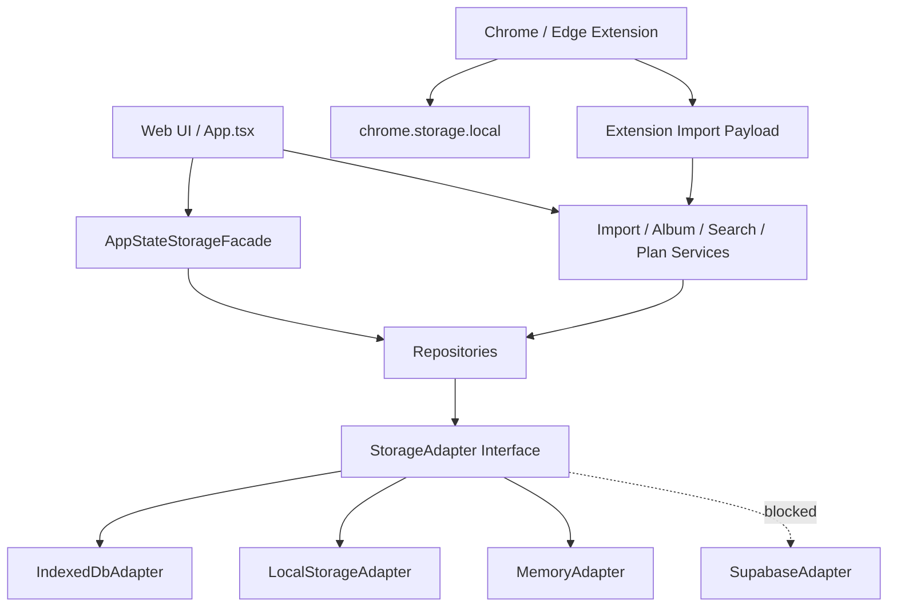

# Storage Adapter 设计

## Task 4 实施更新：Legacy localStorage Snapshot 与备份导出

Task 4 没有把 IndexedDB 接入产品运行时，也没有修改 `LocalStorageAdapter` 的当前业务行为。新增能力集中在 `packages/storage-service/src/legacy-localstorage-snapshot.ts`，用于后续迁移前的只读备份输入：

- `ReadonlyStorageLike` 只包含 `length`、`key(index)`、`getItem(key)`，不暴露 `setItem`、`removeItem`、`clear`。
- `LegacyLocalStorageSnapshotReader` 必须通过构造参数接收 storage，不在模块加载或构造函数里自动访问 `window.localStorage`。
- `LEGACY_PRODUCT_STORAGE_KEYS` 是显式 allowlist；默认包含主 AppState、主题、成就，默认排除 `developerMode`、真实试用、QA 写入探针和 unknown keys。
- Raw backup 保存 allowlist key 的原始字符串，不先 parse 再 stringify；AppState JSON 损坏时仍可生成 raw backup。
- Normalized `StorageSnapshot` 只在 AppState 可解析时生成，映射 `savedItems`、`importBatches`、`importBatchItems`、`smartAlbums`、`actionCards`、`planCards`、`classificationCorrections`、`searchLogs` 和 `settings`。
- Snapshot reader 不调用 `loadAppState`、`persistAppState`、文本修复、分类、AI、IndexedDB 或扩展 storage。
- `computeSha256` 使用 Web Crypto 的 SHA-256；不可用时只记录 `CHECKSUM_UNAVAILABLE`，不会降级为弱 hash。
- `serializeLegacyBackup`、`parseLegacyBackup`、`createLegacyBackupBlob` 和 `createLegacyBackupFilename` 是纯工具，不触发下载、不创建 object URL、不写文件系统。

Raw backup 和标准 `StorageSnapshot` 的边界必须保持清楚：raw backup 是零损失留存旧 key/value 字符串的证据链，`StorageSnapshot` 是后续 Task 5/Task 6 用来验证和写入目标 adapter 的标准数据交换格式。Task 4 不负责引用完整性阻断、URL 去重策略、迁移预览 UI、activeStorage 切换或回滚执行。

## Task 5 实施更新：Migration Preview 层

Task 5 在 storage-service 内新增 `migration-preview.ts`。它不是新的 adapter，也不替代 `MemoryAdapter` 或 `IndexedDbAdapter`；它位于 backup/snapshot 与后续 migration executor 之间，负责把 Task 4 的 `LegacyBackupEnvelope` 转成可审查的迁移预览和计划。

职责边界：

- 读取输入：只接收已构造好的 `LegacyBackupEnvelope`，不直接访问浏览器 `localStorage`。
- 源校验：验证 envelope 格式、raw/normalized checksum、snapshot 版本、counts、store 名称和 JSON-safe 结构。
- 记录校验：按 store 检查主键、日期、状态、必要数组、必要文本字段和 JSON-safe 结构。
- 冲突分析：识别重复主键、`sourceItemId` 重复、normalized URL 重复、目标 adapter 中完全相同记录和同主键冲突。
- 引用校验：检查 `ImportBatchItem -> ImportBatch/SavedItem`、`SmartAlbum -> SavedItem`、`ActionCard -> SavedItem`、`PlanCard -> SavedItem/ActionCard`、`ClassificationCorrection -> SavedItem`。
- 保留校验：保护用户备注、手动标题、sourceUrl、分类字段、分类纠正、专辑状态和手动成员、行动卡内容、计划卡状态、主题和成就设置。
- 计划生成：为每条记录生成 `create`、`skip`、`conflict` 或 `manual_review` 操作。Task 5 不生成覆盖式 `update`。

`MigrationIssue` 使用 `blocking`、`warning`、`info` 三档。`blocking` 表示 Task 6 不能执行；`warning` 表示必须展示给用户确认；`info` 用于解释可重建数据或默认排除数据。issue message 会做安全清洗，不输出完整 token URL、用户备注、收藏正文、Cookie、API Key 或凭证。

`MigrationPreviewReport` 是 UI 和 Task 6 的共同输入，但它仍然只是预览。Task 5 不创建 writer lock，不写 `migrationMetadata`，不执行 `IndexedDbAdapter.importSnapshot`，不切换 `activeStorage`，不创建下载，也不修改任何业务页面。后续 Task 6 必须重新读取并校验 report/plan，不能盲信旧 preview。

当前 `packages/storage-service` 已经有 `StorageAdapter`、`LocalStorageAdapter` 和被阻塞的 `SupabaseAdapter`，但它仍然是按实体方法封装，并且底层继续读写一个整体 AppState JSON。Phase 1 需要把它升级成真正的本地数据访问层，同时避免一轮内重写所有页面和业务 service。

设计目标是：UI 不再直接调用 localStorage；页面通过 repository / service 层访问数据；旧 localStorage 只作为迁移源和回滚源；IndexedDB 成为 Phase 1 主存储；Supabase 继续占位，直到真实项目、Auth 和 RLS 都准备好。

## 设计原则

1. **先兼容，再拆细**：第一步可以提供 AppState 形状的兼容读写，确保现有 `App.tsx` 不需要同时重构页面状态和业务逻辑。随后逐步改为按 repository 查询。
2. **不双向写入**：切换到 IndexedDB 后，localStorage 不再作为 active 写入目标。localStorage 原始快照只用于回滚和人工导出。
3. **派生数据可重建，用户数据不可覆盖**：搜索文本、候选专辑可重建；用户备注、手动标题、分类纠正、确认/归档状态、计划状态不可被自动覆盖。
4. **扩展存储独立**：`chrome.storage.local` 仍归扩展管理，Web StorageAdapter 不读取或写入扩展断点。
5. **Supabase 不假实现**：没有 Supabase URL、anon key、Auth session、RLS 和迁移权限前，SupabaseAdapter 继续明确 blocked。

## 目标接口草图

以下是设计草图，不是本轮要落地的正式代码：

```ts
type StoreName =
  | "savedItems"
  | "importBatches"
  | "importBatchItems"
  | "smartAlbums"
  | "actionCards"
  | "planCards"
  | "classificationCorrections"
  | "searchLogs"
  | "settings"
  | "migrationMetadata"
  | "backups";

type TransactionMode = "readonly" | "readwrite";

interface QueryOptions {
  index?: string;
  range?: IDBKeyRange;
  limit?: number;
  direction?: IDBCursorDirection;
}

interface StorageSnapshot {
  schemaVersion: string;
  exportedAt: string;
  counts: Record<string, number>;
  data: Record<string, unknown[] | unknown>;
  checksum: string;
}

interface StorageAdapter {
  get<T>(store: StoreName, key: IDBValidKey | string): Promise<T | undefined>;
  getAll<T>(store: StoreName): Promise<T[]>;
  query<T>(store: StoreName, options: QueryOptions): Promise<T[]>;
  put<T>(store: StoreName, value: T): Promise<void>;
  bulkPut<T>(store: StoreName, values: T[]): Promise<void>;
  delete(store: StoreName, key: IDBValidKey | string): Promise<void>;
  transaction<T>(
    stores: StoreName[],
    mode: TransactionMode,
    run: (tx: StorageTransaction) => Promise<T>
  ): Promise<T>;
  exportSnapshot(): Promise<StorageSnapshot>;
  importSnapshot(snapshot: StorageSnapshot, options: { mode: "replace" | "merge" }): Promise<void>;
  getSchemaVersion(): Promise<string>;
}
```

## Adapter 分工

| Adapter | Phase 1 角色 | 可写入 | 说明 |
|---|---|---:|---|
| `LocalStorageAdapter` | 只读旧数据、创建备份、回滚恢复。 | 仅回滚时允许写回原 key。 | 不能继续作为常规 active 写入目标，否则会出现双写冲突。 |
| `IndexedDbAdapter` | Phase 1 主实现。 | 是 | 提供 CRUD、批量写入、事务、snapshot、schema version。 |
| `MemoryAdapter` | 测试使用。 | 是 | 用于 repository、迁移验证器和 E2E fixture，避免测试依赖浏览器持久状态。 |
| `SupabaseAdapter` | 继续占位。 | 否 | 没有外部凭证和 RLS 前保持 blocked，不写假代码。 |

## Repository 层建议

Adapter 只关心 store 和事务，不应该知道“复活这条”或“确认专辑”的业务语义。业务语义进入 repository / service：

| Repository | 负责 |
|---|---|
| `SavedItemRepository` | 收藏 CRUD、URL 去重、状态更新、标题/备注更新、搜索字段重建。 |
| `ImportRepository` | ImportBatch / ImportBatchItem 写入、批次状态聚合、导入报告。 |
| `AlbumRepository` | SmartAlbum 查询、确认、归档、成员数组维护、手动加入/移出。 |
| `ActionCardRepository` | ActionCard 按 savedItemId 查询、保存、任务更新。 |
| `PlanCardRepository` | 今日计划、延期、取消、完成、来源收藏关联。 |
| `SettingsRepository` | 主题、developerMode、成就、activeStorage、迁移设置。 |
| `MigrationRepository` | backup、metadata、MigrationReport、锁状态。 |

## 兼容层

现有 Web 主流程仍是 `AppState` 思维，尤其 `apps/web/src/App.tsx` 初始化时加载完整 state，再通过 effect 整体持久化。Phase 1 不应该把这个文件和所有页面一起重写。建议先提供一个兼容层：

```ts
interface AppStateStorageFacade {
  loadAppState(): Promise<AppState>;
  persistAppState(next: AppState): Promise<void>;
  exportSnapshot(): Promise<StorageSnapshot>;
}
```

实现上：

- localStorage 模式：读取旧 key，但迁移入口必须使用 raw snapshot，不能调用会自动写 demo 的 `loadAppState`。
- IndexedDB 模式：从各 store 聚合为 AppState，供现有 UI 使用；持久化时把 AppState diff 或全量拆写到对应 store。
- 后续任务再逐步把导入、搜索、专辑、计划改为 repository 级读写，减少全量 AppState 聚合。

## 派生数据策略

| 数据 | 策略 |
|---|---|
| `SavedItem.searchableText` | 迁移原值，并在验证阶段按当前规则可选重建。重建结果不覆盖用户手动字段。 |
| SmartAlbum 候选 | 候选可以重建，但 confirmed / archived / 手动成员调整必须迁移。 |
| 今日复活推荐 | 派生数据，不单独存 store。由 savedItems/actionCards/planCards 计算。 |
| 搜索结果缓存 | 不迁移，不建 v1 store。 |
| 文本修复预览 | 与存储迁移独立，不自动应用。 |

## activeStorage 与回退

建议使用两个标识：

1. localStorage 小 key：`collection-revival-active-storage`，值为 `localStorage` 或 `indexedDB`。它只保存启动路由选择，不含用户数据。
2. IndexedDB `settings.storageRuntime` 和 `migrationMetadata.current`：保存 schemaVersion、lastMigrationId、lastVerifiedAt。

启动流程：

1. 读取 activeStorage 小 key。
2. 如果是 `indexedDB`，尝试打开 DB 并读取 `migrationMetadata.current`。
3. 如果 IndexedDB 打开失败或校验失败，显示中文提示并回退 LocalStorageAdapter，只读旧数据。
4. 不在失败时删除 IndexedDB，也不静默清空 localStorage。

## 依赖关系图



## 不进入 StorageAdapter 的内容

- 扩展侧 `revival-extension-settings`、`revival-extension-checkpoint`、`revival-extension-scan-state`。
- Vercel `/api/ai` 请求状态。
- 页面临时 form state、toast、hover、loading。
- E2E 测试运行时临时 key。

## 编码阶段建议顺序

1. 先扩展 `packages/storage-service` 的类型和 MemoryAdapter 测试。
2. 再实现 IndexedDbAdapter CRUD 和事务。
3. 再做 raw localStorage snapshot，不调用旧 `loadAppState`。
4. 然后做迁移预览和验证器。
5. 最后接入设置页迁移 UI 和 activeStorage 切换。

这样可以把“存储能力是否可靠”和“页面业务是否接入”分开验收。

## Task 1 定稿：StorageAdapter 契约

本轮已经在 `packages/storage-service` 中定稿契约类型，但没有实现 IndexedDB、MemoryAdapter 或真实迁移。最终接口以 `packages/storage-service/src/contracts.ts` 为准，现有 `LocalStorageAdapter` 仅补充 `kind`、`capabilities`、`healthCheck` 和不支持能力的标准错误；旧的实体方法仍保留，现有页面运行行为不变。

最终 Store 名称为：

```ts
export type StorageEntityName =
  | "savedItems"
  | "importBatches"
  | "importBatchItems"
  | "smartAlbums"
  | "actionCards"
  | "planCards"
  | "classificationCorrections"
  | "searchLogs"
  | "settings"
  | "migrationMetadata"
  | "backups";
```

`StorageRecordMap` 是 Store 与记录类型的唯一映射。业务实体全部引用 `@revival/shared-types`，storage-service 不复制 `SavedItem`、`SmartAlbum`、`ActionCard`、`PlanCard`、`ImportBatch` 等字段定义。只有 `StoredSetting`、`MigrationMetadata`、`StorageBackup` 这三个存储层实体定义在 storage-service 内，因为它们是 Phase 1 数据底座自身需要的契约。

最终 `StorageAdapter` 包含：

- `kind`
- `capabilities`
- `open`
- `close`
- `isAvailable`
- `get`
- `getAll`
- `query`
- `put`
- `bulkPut`
- `delete`
- `clear`
- `transaction`
- `exportSnapshot`
- `importSnapshot`
- `getSchemaVersion`
- `healthCheck`

这些方法只表达通用持久化能力，不包含 AI 分类、搜索排序、React hook、UI toast、页面跳转、扩展通信、Supabase Auth、业务专辑匹配或行动卡生成。

## Task 1 定稿：查询模型限制

查询模型只支持单 Store、单 index 的最小范围查询：

- `equals`
- `lowerBound`
- `upperBound`
- `includeLower`
- `includeUpper`
- `limit`
- `offset`
- `direction`

明确不支持：

- 全文搜索
- 模糊搜索
- embedding 查询
- 向量数据库
- 多字段复杂 AND / OR
- 联表查询
- SQL 字符串
- 云端分页协议
- 智能专辑语义匹配

全文和语义搜索继续由现有 `packages/search-service` 与分类/专辑 service 负责，StorageAdapter 只提供结构化读写和按索引取数。

## Task 1 定稿：事务与 capabilities

`StorageTransactionMode` 只包含 `readonly` 和 `readwrite`。事务回调只能使用同一个 `StorageTransaction` 上下文，不访问 UI、不访问外部网络、不调用另一个 Adapter。Adapter 如果不支持真正事务，必须通过 `capabilities.transactions = false` 暴露，并在调用 `transaction` 时抛出 `STORAGE_NOT_SUPPORTED`。

当前能力状态：

| Adapter | 当前状态 |
|---|---|
| `LocalStorageAdapter` | legacy 兼容实现。当前只保证旧实体方法继续工作；通用接口中的事务、索引查询、snapshot、rollback 还未实现，调用时返回 `STORAGE_NOT_SUPPORTED`。Task 4 才会实现只读 raw snapshot。 |
| `IndexedDbAdapter` | 仅有目标能力常量，未实现。Task 3 开始实现。 |
| `MemoryAdapter` | 仅有目标能力常量，未实现。Task 2 开始实现。 |
| `SupabaseAdapter` | 继续 blocked，占位但不可用，不引入 SDK，不做网络请求。 |

## Task 1 定稿：错误、Snapshot 与 activeStorage

统一错误模型为 `StorageError`，错误代码定义在 `STORAGE_ERROR_CODES`。错误对象包含 `code`、`adapter`、`store`、`recoverable` 和可选 `cause`。错误消息会做安全处理，避免输出完整 URL、token、API key、Cookie、用户备注或收藏正文。

`StorageSnapshot` 是数据交换格式，不等于 IndexedDB 内部格式。它必须 JSON-safe，日期用 ISO string，`Set` / `Map` 后续实现时必须转成数组或普通对象。`records` 中缺失某个 Store 表示“未包含”，不表示“清空”。

`StorageImportMode` 包含：

- `preview`
- `replace`
- `merge`
- `staging`

Phase 1 正式迁移只能走 `staging`，不能直接 replace 用户真实数据。

`ActiveStorageMetadata` 只允许 `localStorage` 与 `indexedDB`。activeStorage 标识不进入整个 AppState 大对象，后续应使用独立最小启动元数据；切换 IndexedDB 前必须完成 migration verification，失败时继续使用 LocalStorageAdapter。

## Task 1 定稿：Repository 边界

本轮新增的是 repository 接口草图，不实现 repository。后续页面不得直接调用 Adapter，更不得直接调用 localStorage。Adapter 负责通用持久化、事务、snapshot 和底层错误标准化；Repository 负责业务语义查询、实体校验、引用关系、派生字段、用户手动修改保护、专辑成员语义、行动卡和计划卡关系。

已定稿接口草图：

- `SavedItemRepository`
- `ImportRepository`
- `SmartAlbumRepository`
- `ActionCardRepository`
- `PlanCardRepository`
- `ClassificationCorrectionRepository`
- `SettingsRepository`

扩展的 `chrome.storage.local`、扫描 checkpoint、popup state、bridge state、progress state、小红书 DOM 临时数据、Cookie、登录凭证和 API Key 都不属于 Web StorageAdapter 边界。

## Task 2 补充：MemoryAdapter 已落地

Task 2 在 `packages/storage-service` 中实现了 `MemoryAdapter`，它只用于单元测试、契约验证、后续迁移测试和 Task 3 IndexedDbAdapter 的参考实现，不进入 Web 生产运行路径。它不访问 `localStorage`、IndexedDB、文件系统、网络、React 或浏览器 DOM，也不读取用户真实浏览器数据。

### MemoryAdapter capabilities

`MemoryAdapter` 的运行时能力为：

| capability | value | 说明 |
|---|---:|---|
| `transactions` | true | 单实例内存事务，`readwrite` 失败会完整回滚。 |
| `indexes` | true | 支持 Task 1 定义的单 Store、单 index 查询。 |
| `snapshots` | true | 支持 JSON-safe Snapshot 导出。 |
| `rollback` | true | 通过内存快照实现事务和 staging 导入回滚语义。 |
| `persistence` | false | 新建实例不共享数据，关闭同一实例后重新打开会保留内存数据。 |
| `bulkWrite` | true | `bulkPut` 采用全有或全无语义。 |
| `queryRanges` | true | 支持 `equals` 或范围查询，但不支持两者混用。 |

### 生命周期、CRUD 与查询

- 初始状态 `opened = false`，`isAvailable()` 返回 `true`。
- `open()` 和 `close()` 都是幂等操作。`close()` 不清空同一实例内存数据；新实例不共享数据。
- 未 `open()` 时执行数据操作会抛出 `STORAGE_UNAVAILABLE`。
- `put()` 校验主键和 JSON-safe 记录，按主键覆盖，不生成业务 id，不补业务字段，不修改输入对象。
- `get()`、`getAll()`、`query()` 返回深拷贝，外部修改返回值不会污染内部 Store。
- `bulkPut()` 采用全有或全无语义，缺主键、重复主键或非 JSON-safe 记录都会导致整批不写入。
- Task 2 将 Store 主键配置固化为 `STORE_PRIMARY_KEYS`；其中 `settings` 使用 `key`，其他 Store 使用 `id`。
- 查询仍然严格限制为单 Store、单 index。支持 `equals`、范围边界、分页和方向；不支持全文、模糊、embedding、向量、多字段 AND/OR、联表查询或 SQL 字符串。

### 事务语义

`transaction(stores, mode, operation)` 使用事务私有 Store 快照。`readonly` 可以读取但不能写入；`readwrite` 成功后一次性提交声明的 stores，失败则完整回滚。事务只能访问声明的 Store，访问未声明 Store 会失败。MemoryAdapter 不支持嵌套事务；事务执行期间再次从 Adapter 外部启动并发事务会返回 `STORAGE_LOCKED`。这只是单实例锁，不等于后续 IndexedDB 的多标签页锁。

### Snapshot 与导入模式

`exportSnapshot()` 默认导出全部 Store，也支持 `options.stores` 部分导出。Snapshot 是 JSON-safe 数据交换格式，不等于 IndexedDB 内部格式。`settings.internal = true` 的记录默认不导出，只有 `includeInternalSettings = true` 时才包含。

`importSnapshot()` 支持 `preview`、`merge`、`replace` 和 `staging`。`preview` 只验证和统计不写入；`merge` 按 `preserveExisting` 处理同主键；`replace` 只替换明确包含的 Store；`staging` 先写入独立临时内存集合并验证，成功后一次性替换目标 Store，失败时主数据完全不变。正式用户迁移仍然只能走后续迁移 UI 的 staging 流程；MemoryAdapter 的 merge / replace 是为了测试契约完整性。

### 可复用 Adapter Contract Suite

Task 2 新增 `runStorageAdapterContractTests()`。它不绑定 MemoryAdapter，后续 Task 3 的 IndexedDbAdapter 必须复用同一套测试，至少覆盖生命周期、CRUD、bulkPut、单索引 query、transaction、Snapshot、import、错误安全和所有 Store 的代表性 fixture。当前 MemoryAdapter 运行结果为 44 个测试、207 个断言。

### 明确未做

Task 2 没有创建 IndexedDB，没有调用 `indexedDB.open`，没有引入 Dexie / idb，没有切换 activeStorage，没有修改 `loadAppState` / `persistAppState`，没有迁移或读取用户真实 `localStorage`，也没有修改 Web 页面、路由、扩展、分类、行动卡或计划卡业务逻辑。
## Task 3 补充：IndexedDbAdapter 已落地但未接入产品运行时

Task 3 在 `packages/storage-service/src/indexeddb-adapter.ts` 中实现了 `IndexedDbAdapter`，它只作为底层存储能力和后续迁移执行器的依赖存在。当前 Web 启动流程、`activeStorage`、`loadAppState`、`persistAppState`、页面、扩展和导入协议都没有切到 IndexedDB，也没有读取或迁移用户真实浏览器数据。

`IndexedDbAdapter` 的正式运行代码只使用浏览器原生 IndexedDB API：`globalThis.indexedDB`、`IDBDatabase`、`IDBTransaction`、`IDBObjectStore`、`IDBIndex`、`IDBKeyRange` 和 `IDBRequest`。本轮没有引入 Dexie、`idb` 或其他运行时封装库。单元测试使用 `fake-indexeddb` 作为 devDependency 来模拟浏览器 IndexedDB；它只存在于 `packages/storage-service` 的测试环境，不进入 production bundle，也不被 adapter 源码 import。

数据库名称定稿为 `collection-revival-local`，schemaVersion 为 `1`。v1 创建 11 个 object stores：`savedItems`、`importBatches`、`importBatchItems`、`smartAlbums`、`actionCards`、`planCards`、`classificationCorrections`、`searchLogs`、`settings`、`migrationMetadata`、`backups`。除 `settings` 使用 keyPath `key` 外，其余 store 使用 keyPath `id`；所有 store 都显式禁止 `autoIncrement`。

IndexedDbAdapter 的 capabilities 为：

| capability | value | 说明 |
|---|---:|---|
| `transactions` | true | 使用原生 `IDBTransaction`，同一事务 wrapper 内的所有操作共享同一个 native transaction。 |
| `indexes` | true | 按 `STORAGE_INDEXES` 和 `INDEXED_DB_INDEX_KEY_PATHS` 创建 v1 indexes。 |
| `snapshots` | true | 支持全量和部分 store 的 JSON-safe Snapshot export。 |
| `rollback` | true | 表示单个 readwrite transaction 和 staging import 失败不会污染主数据；完整迁移历史回滚仍属于 Task 6。 |
| `persistence` | true | close 后 reopen 仍保留同一 databaseName 中的数据。 |
| `bulkWrite` | true | `bulkPut` 使用单个 readwrite transaction，任一记录失败则整批回滚。 |
| `queryRanges` | true | `equals`、`lowerBound`、`upperBound` 会映射到 `IDBKeyRange`。 |

生命周期语义如下：`isAvailable()` 只检查 IndexedDB 和 IDBKeyRange 是否存在，不写入数据；`open()` 幂等，使用 `onupgradeneeded` 创建 v1 schema，`onblocked` 映射为 `STORAGE_LOCKED`，`VersionError` 映射为 `STORAGE_SCHEMA_MISMATCH`；打开成功后注册 `onversionchange`，旧连接收到版本变化会自动 close 并清空 adapter 内部 db 引用。`close()` 只关闭连接，不删除数据库。

查询模型仍保持 Task 1 的最小边界：单 store、单 index；支持 `equals` 或范围查询、`limit`、`offset`、`direction`。不支持全文搜索、模糊搜索、embedding、向量数据库、多字段 AND/OR、联表查询或 SQL 字符串。无 `orderBy` 的 `getAll()` 使用 IndexedDB 原生 object store key 顺序；contract suite 通过 `preservesInsertionOrder` 区分 MemoryAdapter 的插入顺序和 IndexedDB 的主键顺序。

`transaction(stores, mode, operation)` 创建一个 native `IDBTransaction`，事务 wrapper 的 `get/getAll/query/put/bulkPut/delete/clear` 都在这个 native transaction 中执行。`readonly` 禁止写入；访问未声明 store 会失败；operation 抛错时 adapter 调用 `abort()` 并等待事务失败，保证多 store readwrite 原子回滚。嵌套 transaction 不支持，外层事务会以 `STORAGE_TRANSACTION_FAILED` 结束。事务回调不能等待无关长时异步任务，否则原生 IndexedDB transaction 可能失活；这属于调用方约束，后续 repository 实现必须遵守。

Snapshot export 使用 readonly 多 store transaction 尽量获得一致视图。默认导出全部 store，也可通过 `options.stores` 指定；`settings.internal = true` 默认排除，只有 `includeInternalSettings = true` 时才包含。Snapshot 是数据交换格式，不等于 IndexedDB 内部格式；本轮仍不实现正式 checksum，也不触发文件下载。

Snapshot import 支持 `preview`、`merge`、`replace`、`staging`。其中 `preview` 不写数据库；`merge` 按 `preserveExisting` 决定同主键跳过或覆盖；`replace` 只清空 Snapshot 明确包含或 options 指定的 store；`staging` 先使用 MemoryAdapter 做结构和导入语义验证，验证通过后再使用一个 IndexedDB 多 store readwrite transaction 写入目标 store。Task 3 不创建额外 staging object stores，不修改 `activeStorage`，也不写迁移状态机。

可复用测试入口已经扩展为同时覆盖 MemoryAdapter 和 IndexedDbAdapter。`runStorageAdapterContractTests()` 仍是底层适配器必须通过的通用契约；IndexedDbAdapter 额外补充 schema、keyPath、index、persistence、versionchange、blocked、VersionError、多 store transaction、Snapshot internal settings、staging 污染保护等专属测试。Task 3 当前 storage-service 单包测试结果为 88 tests / 468 assertions passed。

Task 4 的边界保持不变：只做 raw localStorage snapshot 和备份导出，不调用会自动写 demo 的 `loadAppState`，不切 activeStorage。Task 5 再做 migration preview / validator，Task 6 才做迁移执行、断点恢复、多标签 writer lock 和正式回滚。

## Task 6 补充：MigrationExecutor 仍是库能力

Task 6 在 `packages/storage-service` 内新增迁移执行层，但它没有接入 Web 启动流程，也没有改变默认存储。新增能力包括 `MigrationExecutor`、`MemoryMigrationLockProvider`、`WebLocksMigrationLockProvider`、`MigrationExecutionMetadataRecord` 和 `MigrationExecutionError`。执行器只消费 Task 4 的 `LegacyBackupEnvelope` 与 Task 5 的 `MigrationPreviewReport/MigrationPlan`，并要求调用方传入 `userConfirmed = true`，所以不会在页面打开时静默迁移。

执行器不会自己读取 `localStorage`，不会调用 `loadAppState`、`persistAppState`、`LegacyLocalStorageSnapshotReader` 或 `createBrowserReadonlyStorage`，也不会实例化正式 IndexedDB。它只写入显式传入的 target adapter；当前测试覆盖了 MemoryAdapter 和 fake-indexeddb 注入的 IndexedDbAdapter。

写入边界是：允许写入 target adapter 的 `backups`、`migrationMetadata` 和计划中的业务 stores；禁止写旧 localStorage、禁止写 `chrome.storage.local`、禁止切换 `activeStorage`。初次执行要求目标业务 stores 为空；失败恢复时根据 checkpoint、数量和 checksum 判断哪些 store 可跳过、验证或继续写入。`backups` store 保存 normalized Snapshot，并把 raw backup 作为扩展字段保留给后续检查。

Task 6 的 rollback 只在 `activeStorageSwitched = false` 时允许。它会清空本次迁移写入的业务 stores，保留 `backups` 和 `migrationMetadata` 作为审计证据。真正的 activeStorage 切换、设置页入口、多标签页 UI 锁定和生产数据迁移仍属于后续任务。
