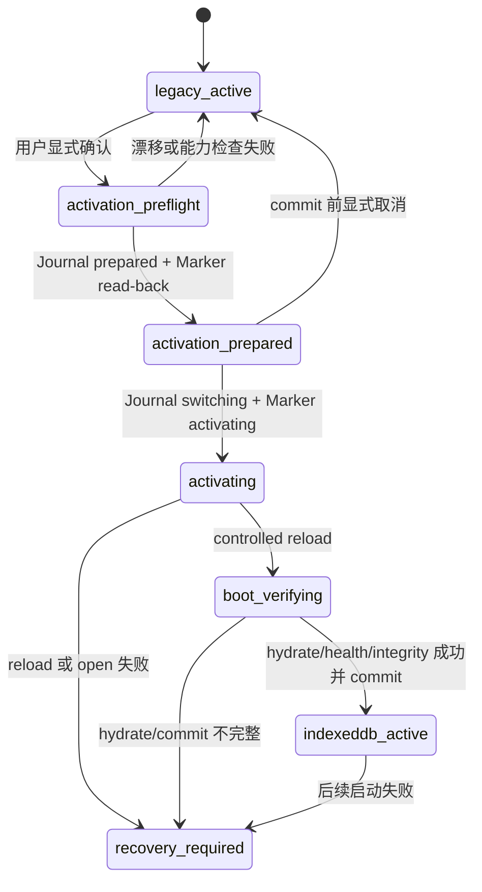

# Storage Bootstrap And Activation Protocol

## 1. 核心原则

迁移完成只表示数据已复制和校验，不表示产品已经从 IndexedDB 启动。正式启用采用两阶段切换，Bootstrap Marker 用于加载业务数据前的后端选择，Activation Journal 用于跨 localStorage 与 IndexedDB 的故障恢复。两者不可能原子提交，因此任何中间状态都必须可判定，不能用一个布尔值替代协议。

## 2. Bootstrap Marker

候选 key：`collection-revival-storage-bootstrap:v1`。Task 8 设计阶段不创建它。

```ts
interface StorageBootstrapMarker {
  version: 1;
  revision: number;
  state:
    | "legacy_active"
    | "activation_prepared"
    | "activating"
    | "indexeddb_active"
    | "recovery_required";
  activeBackend: "localStorage" | "indexedDB";
  migrationId?: string;
  activationId?: string;
  journalId?: string;
  databaseName?: string;
  schemaVersion?: number;
  sourceChecksum?: string;
  targetChecksum?: string;
  preparedAt?: string;
  activatedAt?: string;
  lastVerifiedAt?: string;
}
```

Marker 不保存收藏、备注或 URL。它不使用独立 checksum，原因是其真实性必须通过 IndexedDB Journal 和 MigrationMetadata 交叉验证；自校验 marker 仍无法解决两存储原子性。所有写入使用 canonical JSON，写后立即 read-back 并验证字段。

Marker 规则：

- 缺失：默认 `legacy_active`，兼容所有现有用户，不自动创建 key。
- JSON 损坏或版本不支持：进入 `recovery_required`，不得覆盖 marker 或写 demo。
- `legacy_active`：只允许 LocalStorageRuntime。
- `activation_prepared`：读取 Journal；若仍 prepared，可取消准备或继续激活。
- `activating`：只允许恢复激活或进入 Recovery Screen。
- `indexeddb_active`：必须找到 committed Journal 和 `activeStorageSwitched=true`。
- `recovery_required`：启动级恢复页先于普通 App。

主题清理、数据清理和 QA 工具不得删除 Bootstrap Marker。

## 3. Activation Journal

Journal 放在现有 `migrationMetadata` Store，不新增 object store，不升级数据库版本。使用 `recordType: "activation"` 与现有 `recordType: "migration"` 区分；Task 7C 的 inspection 继续只识别含 execution checkpoints 的 migration 记录。

```ts
interface StorageActivationJournal {
  id: string;                 // activation:<activationId>
  recordType: "activation";
  activationId: string;
  migrationId: string;
  status:
    | "prepared"
    | "switching"
    | "boot_verifying"
    | "committed"
    | "failed"
    | "cancelled";
  sourceBackend: "localStorage";
  targetBackend: "indexedDB";
  sourceChecksum: string;
  targetChecksum: string;
  targetSchemaVersion: 1;
  markerRevision: number;
  preparedAt: string;
  switchingAt?: string;
  bootVerifiedAt?: string;
  committedAt?: string;
  failedAt?: string;
  cancelledAt?: string;
  errorCode?: string;
}
```

Journal、对应 MigrationMetadata 和必要 Runtime settings 可在同一个 IndexedDB transaction 中更新。它不保存用户正文。`migrationMetadata` 的共享类型需要在 Task 8C 扩展为可判别 union；现有 `activeStorageSwitched: false` 字面量需在 Task 8D 改成 boolean，但只能由 activation commit transaction 写 true。

## 4. schemaVersion 决策

Task 8 保持 IndexedDB schemaVersion 1：

- Journal 复用 migrationMetadata。
- Runtime user、schema 和 order manifest 复用 settings。
- 现有 Store 和 index 足以完成启动和差异写入。
- 不在激活临界路径引入 v1 到 v2 的 versionchange/blocked 风险。

未来只有在必须新增 object store 或 index 时才设计 v2，并作为独立迁移，不与首次 activation 混合。

## 5. 激活状态机



## 6. 两阶段切换时序

### Phase 1：Prepare

1. 用户在 `completed_not_activated` 点击“正式启用新存储”。
2. 完成四项启用确认。
3. 获取 `collection-revival:storage-authority` 独占 Web Lock。
4. BroadcastChannel 通知其他标签页进入 stale/read-only；Runtime writer 每次写前也检查 Marker revision。
5. 冻结当前标签页全部业务写入。
6. 重新生成主 AppState、theme、achievements 的 Legacy Snapshot 与 SHA-256。
7. 对比 migration source checksum，验证无 source drift。
8. 验证 Backup、MigrationMetadata、target schema、Store checksums、Runtime settings/order manifests。
9. 在 IndexedDB 写 Journal `prepared` 并等待 transaction complete。
10. 写 Marker `activation_prepared`，read-back 验证。

Prepare 任一步失败都保持 localStorage 为权威源。只有在 Marker 尚未进入 `activating` 且 Journal 未 committed 时，允许取消准备：Journal 标记 cancelled，Marker 恢复 legacy_active，解除冻结。

### Phase 2：Switch And Commit

1. 更新 Journal 为 `switching`。
2. 写 Marker `activating` 并 read-back。
3. 发出 backend-changing 通知并受控 reload。
4. 新启动读取 Marker，在渲染 App 前打开 IndexedDB。
5. 交叉验证 Journal、MigrationMetadata、schema、target checksum 和 Marker revision。
6. hydrate 完整 AppState，执行 integrity healthCheck。
7. 在一个 IndexedDB transaction 中把 Journal 置 `committed`，把对应 MigrationMetadata 的 `activeStorageSwitched` 写 true，并记录 boot verification。
8. transaction complete 后写 Marker `indexeddb_active` 并 read-back。
9. 只有此时 App 进入 `ready`，释放激活锁并允许 IndexedDbRuntime 写入。

`activeStorageSwitched=true` 的唯一时机是步骤 7：IndexedDB 已成功打开、完整 hydrate 和校验，普通业务 UI 尚未解除冻结。不能在点击按钮、迁移 completed、写 Marker prepared 或 reload 前写 true。

## 7. 中断恢复矩阵

| Marker | Journal | 处理 |
|---|---|---|
| 缺失 | 无 | legacy_active |
| `activation_prepared` | `prepared` | 显示继续或取消准备，不自动继续 |
| `activation_prepared` | 无/冲突 | Recovery Screen |
| `activating` | `switching/boot_verifying` | 重试 IndexedDB boot，不进入普通 App |
| `activating` | `committed` | 验证后补写 indexeddb_active marker |
| `indexeddb_active` | `committed` 且 metadata true | IndexedDbRuntime |
| `indexeddb_active` | 非 committed 或 metadata false | Recovery Screen |
| `legacy_active` | committed journal | Recovery Screen，防止旧库继续写 |
| 任意损坏 | 任意 | Recovery Screen |

## 8. IndexedDB boot 失败

正式激活后禁止静默回到可写 localStorage。失败时：

- 普通 App 不渲染。
- 进入 Storage Recovery Screen。
- 允许重试 IndexedDB、查看安全错误、导出旧 raw backup、在 IndexedDB 可读时导出 Snapshot 和安全报告。
- commit 前允许取消 prepared activation；commit 后不允许简单改 marker 回旧库。
- localStorage 可以作为只读历史来源和导出来源，不能成为 fallback writer。

## 9. 正式启用后的回退

Task 7C rollback 只清理迁移写入的目标 Store，要求 `activeStorageSwitched=false`。一旦 committed，它必须继续拒绝。

正式启用后的“回到旧存储”是独立反向迁移：

1. 冻结 IndexedDbRuntime 写入并获取 authority lock。
2. 从 IndexedDB 导出和验证 Snapshot。
3. 生成新的 legacy-compatible AppState 和独立备份。
4. 写入 staging key，read-back 校验。
5. 使用独立 reverse activation journal 切换权威源。
6. 受控 reload 并验证 LocalStorageRuntime。

Phase 1 不实现这个能力，也不提供按钮。

## 10. 多标签页协议

- Web Lock `collection-revival:storage-authority` 保护激活和每次权威写入；业务写可以使用 shared lock，激活使用 exclusive lock。
- `BroadcastChannel("collection-revival-storage")` 发送 preparing、backend_changed、recovery_required。
- 同时监听 `storage` event 作为 Marker 变化通知。
- 旧标签页收到 revision/backend 变化后立即进入只读阻断页，不能继续写，要求刷新。
- BroadcastChannel 不可用时仍依赖 Web Lock + 每次写前 Marker guard；Web Locks 不可用则禁止激活。
- 两个标签页同时激活时只有一个获得 exclusive lock，另一个显示“其他页面正在处理”。

## 11. Recovery Screen

这是 App 启动级页面，触发于 marker/journal 冲突、activating boot 失败、indexeddb_active open 失败、schema mismatch、integrity 失败或站点数据部分清理。

提供：

- 重试新存储；
- 查看安全错误码和能力报告；
- 导出旧 localStorage raw backup；
- IndexedDB 可读时导出 Snapshot；
- 下载不含正文的恢复报告；
- commit 前取消 prepared activation。

不提供忽略错误进入应用、直接切回可写 localStorage、清空 IndexedDB、删除 Backup 或 Metadata。

## 12. 浏览器异常策略

| 异常 | 激活前 | 激活中 | 激活后 |
|---|---|---|---|
| IndexedDB 不可用/隐私限制 | 阻止 | Recovery | Recovery，不 fallback 写旧库 |
| QuotaExceeded | 阻止写 Journal | 保留中间状态并 Recovery | 当前动作失败，内存不提交 |
| versionchange/blocked | 要求关闭其他标签页 | 保持冻结 | stale runtime + 刷新提示 |
| Web Crypto 不可用 | 阻止漂移校验 | 不进入 switching | integrity check 受限，Recovery |
| Web Locks 不可用 | 阻止激活 | 不 fallback | 已 active 时写入受限并提示升级浏览器 |
| databases() 不可用 | 不用于正式 boot 判定 | 直接按 Marker 显式 open | 依 Marker open，不做存在性探测 |
| 页面崩溃/reload 中断 | legacy 仍 active | 由 Marker+Journal 恢复 | 由 committed Journal 恢复 |
| 站点数据被部分清理 | 重新迁移 | Recovery | Recovery，不能猜测权威源 |

## 13. Activation UI

入口只在 `completed_not_activated` 且 Backup、Metadata、schema、source drift、browser capabilities 全部通过时显示。

步骤：重新核对、四项确认、激活准备、重新加载、启动验证、成功。成功页显示当前数据源 IndexedDB、旧数据仍保留、启用时间、实体数量和健康状态；Phase 1 不提供删除旧数据。
## 14. Task 8C 实际落地

Task 8C 已创建 `collection-revival-storage-bootstrap:v1` 契约，但只有用户显式完成 Prepare 才写入。当前状态仅允许 `legacy_active`、`activation_prepared`、`recovery_required`，且 `activeBackend` 固定为 `localStorage`。实际 Prepare 顺序为 Journal `preparing` -> Marker `activation_prepared` read-back -> Journal `prepared` read-back；Marker 已写而 Journal 定稿失败时，Marker 再递增 revision 并进入 `recovery_required`。广播通道为 `collection-revival-storage-runtime:v1`，BroadcastChannel 缺失时使用瞬时 storage-event 通知 key。Task 8D 才能增加 `activating`、`indexeddb_active`、controlled reload 和正式 IndexedDB boot。
## 15. Task 8D 两阶段正式激活

Task 8D 已落地 `activating` 与 `indexeddb_active`。正式启用必须经过四项确认、Web Lock、完整 final recheck、Journal `switching` read-back、Marker `activating` read-back和受控 reload。启动后由 `AppBootstrap` 严格选择 `IndexedDbRuntime`，完成 open、healthCheck、hydrate 与提交前 checksum 校验后，才在同一 IndexedDB 事务中写入 `activeStorageSwitched=true`、Journal `committed` 与 runtime activation metadata，随后 final Marker。已提交后的正常启动校验提交证据和当前运行时健康，不再把可变用户数据与激活前快照强行比对。任何冲突进入 Recovery Screen，不会静默回到可写 localStorage。
