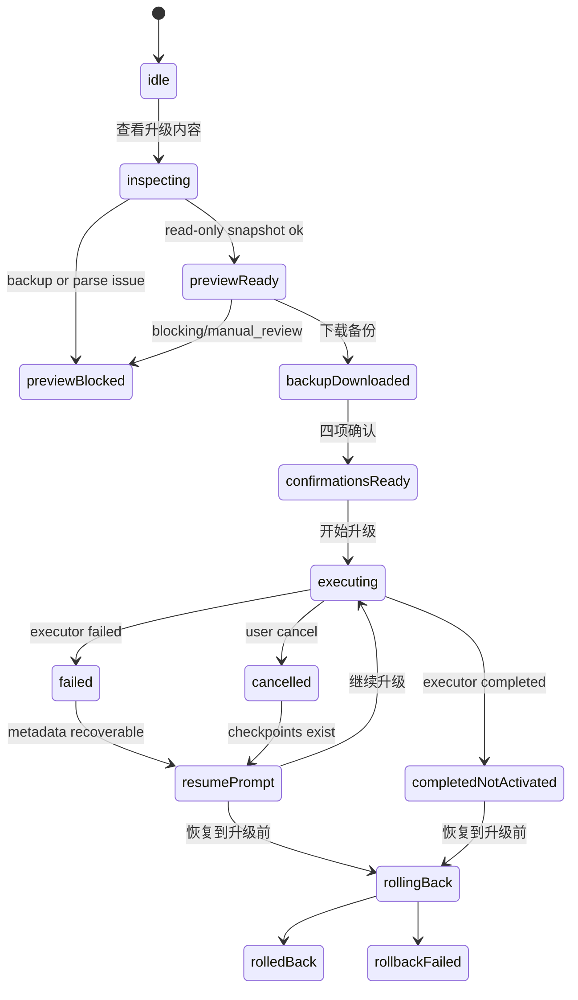

# Task 7 Migration UI Specification

Task 7 adds the user-facing migration surface under Settings, but it must not silently migrate data and must not switch `activeStorage`. It is a confirmation-heavy safety flow for upgrading local data storage from legacy localStorage toward IndexedDB readiness.

This spec assumes Task 6 blocking gaps are fixed before any execution UI is enabled. Until then, Task 7A may implement read-only preview and backup download only.

## Product Entry

Location:

`Settings -> Data Management -> Upgrade local data storage`

The entry should not live under "Development and Testing". It is a real user data management function, but it should be visually quiet and clearly labeled as a local browser upgrade.

Entry card copy:

Title: `升级本地数据存储`

Description:

`为了支持几千条收藏、更稳定的搜索和未来同步，需要把当前浏览器里的本地数据升级到新的存储方式。升级前会先创建备份，不会删除现有 localStorage 数据。`

Primary action: `查看升级内容`

Secondary action: `暂不升级`

Small note:

`本功能只处理当前浏览器里的收藏复活数据，不会读取小红书账号、扩展断点或其他网站数据。`

## User Flow

1. User opens Settings and clicks `查看升级内容`.
2. UI creates a read-only legacy snapshot from allowlisted localStorage keys.
3. UI creates raw backup envelope and migration preview.
4. User sees a summary: what will be preserved, regenerated, excluded, and what needs attention.
5. User downloads the backup file.
6. If preview has blocking issues or manual review, user cannot start execution.
7. If preview is executable and Task 6 executor is accepted, user must check four confirmations.
8. UI creates and opens an explicit IndexedDbAdapter only after confirmation.
9. UI creates `WebLocksMigrationLockProvider`. If Web Locks is unavailable, execution is blocked.
10. User clicks `开始升级`.
11. Executor writes backup, metadata, stores, checkpoints, and final verification.
12. Completion state is `completed_not_activated`: IndexedDB data exists and is verified, but the app still reads legacy localStorage.
13. User can view report, keep backup, or roll back the staged IndexedDB migration.
14. Active storage switch remains a later Task 8 decision.

## Wizard Steps

### Step 1: Read-Only Check

Purpose: inspect legacy data and create the backup envelope without writing anything.

Primary status messages:

- `正在检查当前浏览器里的收藏数据...`
- `检查完成，当前还没有修改任何数据。`
- `当前无法生成升级预览，原始备份仍可导出。`

Required behavior:

- Use `LegacyLocalStorageSnapshotReader`.
- Do not call `loadAppState`.
- Do not call `persistAppState`.
- Do not open IndexedDB.
- Do not call MigrationExecutor.
- Do not mutate localStorage.

### Step 2: Preview

Purpose: explain the result in human terms before technical details.

Top states:

- Can proceed: `已检查 X 条收藏，当前数据可以安全升级。`
- Needs review: `有 X 条数据需要确认，其余内容可以保留。`
- Blocked: `备份或数据结构存在问题，当前不会修改任何数据。`

Summary blocks:

- `将保留`: saved items, source URLs, user notes, edited titles, manual classifications, confirmed/archived albums, action cards, plan cards, classification corrections, theme and achievements.
- `将重新生成`: search indexes, temporary recommendations, rebuildable caches, candidate albums that are not user-confirmed when the migration plan marks them rebuildable.
- `默认排除`: QA data, real-test records, developerMode, extension checkpoints, API keys, environment variables.
- `需要确认`: grouped issues such as duplicates, broken optional references, manual_review operations, checksum mismatch, unsupported schema, or invalid records.

Manual review behavior:

- Task 7 first implementation should block execution if any `manual_review` operation remains.
- The UI may allow report export, but should not build a per-record editor in Task 7A/B.
- Copy: `这些数据需要先确认，当前不会开始升级。`

### Step 3: Backup Download

Purpose: make sure the user has a recoverable copy before any execution.

Button: `下载升级前备份`

Warning copy:

`备份中可能包含你的收藏标题、备注和来源链接。请保存在自己的设备中，不要随意分享。`

Implementation requirements:

- Use `serializeLegacyBackup`.
- Use `createLegacyBackupBlob`.
- Use `createLegacyBackupFilename`.
- Use `URL.createObjectURL`, temporary link click, and `URL.revokeObjectURL` only inside the UI action.
- Set local UI state `backupDownloadTriggered=true`.
- Do not upload backup to Vercel.
- Do not save backup content to localStorage.
- Do not store local disk path.

### Step 4: Four Confirmations

Execution cannot start until all four confirmations are checked:

1. `我已经下载并保存了升级前备份。`
2. `我理解升级只影响当前浏览器里的收藏复活数据，不会删除原 localStorage 数据。`
3. `我理解升级完成后暂时仍不会切换 activeStorage。`
4. `我确认当前没有其他页面正在执行数据升级。`

If any confirmation is missing, the primary button stays disabled with a clear reason.

### Step 5: Execution Progress

Displayed stages:

- `准备安全锁`
- `确认备份`
- `写入收藏`
- `写入导入批次`
- `写入智能专辑`
- `写入行动卡`
- `写入计划卡`
- `写入分类纠正`
- `写入设置`
- `校验数据`
- `完成`

Progress should map from `MigrationExecutionProgress`:

| Executor status | UI state |
|---|---|
| `lock_acquiring` | `正在获取安全锁` |
| `preflight` | `正在做升级前检查` |
| `backup_persisted` | `备份已保存到新存储` |
| `writing_store` | `正在写入 ${currentStore}` |
| `verifying_store` | `正在校验 ${currentStore}` |
| `verifying_all` | `正在做最终校验` |
| `completed` | `升级写入完成，尚未启用` |
| `failed` | `升级停止，新存储不会启用` |
| `cancelled` | `升级已取消，可继续或恢复` |
| `rollback_pending` | `正在恢复升级前状态` |
| `rolled_back` | `已恢复到升级前状态` |
| `rollback_failed` | `恢复没有全部完成，请保留备份并停止操作` |

### Step 6: Completed Not Activated

Completion copy:

`本地数据已经写入并校验完成，但当前应用仍然使用原来的 localStorage 数据。下一阶段会单独实现启用新存储和回退入口。`

Actions:

- `查看迁移报告`
- `保留备份`
- `恢复到升级前状态`
- `稍后再启用`

The UI must not call active storage switching code in Task 7.

## UI State Machine

## Controller Boundary

Task 7 should introduce a small controller rather than placing migration logic inside React components.

Suggested name:

`MigrationFlowController`

Responsibilities:

- Build read-only snapshot and backup envelope.
- Build migration preview and plan.
- Expose summary state to React.
- Trigger backup download helper.
- Validate four confirmations.
- Create explicit IndexedDbAdapter only at execution time.
- Create WebLocksMigrationLockProvider only at execution time.
- Call `execute`, `resume`, `rollback`.
- Convert executor errors into safe Chinese UI messages.
- Never modify `activeStorage`.

React responsibilities:

- Render states and buttons.
- Hold transient form state.
- Display progress, report, and errors.
- Avoid calling storage adapters directly.

## IndexedDB Timing

Task 7A:

- Do not open IndexedDB.
- Do not create target adapter.
- Do not write anything.

Task 7B:

- After backup download and four confirmations, create `IndexedDbAdapter`.
- Use a stable database name from schema docs.
- Open target adapter explicitly.
- Confirm business stores are empty through executor preflight.
- Do not switch activeStorage.

Task 7C:

- Reopen IndexedDB to inspect `migrationMetadata` and `backups` after refresh.
- Resume or rollback only after explicit user action.
- Do not recreate a migration plan from memory after refresh.

## Web Locks

Task 7B must use `WebLocksMigrationLockProvider`.

Rules:

- Check `globalThis.navigator?.locks`.
- If unavailable, block execution.
- Do not fallback to memory lock in production UI.
- Do not implement localStorage lease.
- Do not use interval-based lock.
- If another tab holds the lock, show: `另一个页面正在升级数据，请等待它完成后再试。`

Browser unsupported copy:

`当前浏览器暂不支持安全的数据升级，请使用最新版 Chrome 或 Edge。`

## Error Message Mapping

Do not display raw DOMException, object store names, foreign-key wording, or transaction internals as primary copy.

| Error code | User copy |
|---|---|
| `MIGRATION_LOCK_UNAVAILABLE` | `另一个页面正在升级数据，请等待它完成后再试。` |
| `MIGRATION_TARGET_UNAVAILABLE` | `新存储暂时无法打开，当前数据没有被修改。` |
| `MIGRATION_USER_CONFIRMATION_REQUIRED` | `请先完成所有确认项，再开始升级。` |
| `MIGRATION_PREVIEW_BLOCKED` | `仍有数据需要确认，暂时不能开始升级。` |
| `MIGRATION_SOURCE_MISMATCH` | `备份和预览结果不一致，请重新检查当前数据。` |
| `MIGRATION_TARGET_NOT_EMPTY` | `新存储中已经存在其他数据。为了避免覆盖，升级已停止。` |
| `MIGRATION_VERIFY_FAILED` | `写入后的校验没有通过，新存储不会启用。` |
| `MIGRATION_RESUME_CONFLICT` | `已写入的数据与升级记录不一致，不能自动继续。建议先恢复到升级前。` |
| `MIGRATION_ROLLBACK_FAILED` | `恢复过程没有全部完成。请保留页面和备份，不要清理浏览器数据。` |
| `MIGRATION_ALREADY_ACTIVATED` | `新存储已经被启用，不能使用这条回滚路径。` |

Technical details may be shown in a collapsed section with safe error code, store name, and record id only.

## Page Refresh and Recovery

After refresh:

- Do not rely on in-memory envelope.
- Inspect IndexedDB `migrationMetadata` and `backups`.
- If status is `writing_store`, `verifying_store`, `failed`, or `cancelled`, show a recovery panel.
- Do not automatically resume.
- User must click `继续升级` or `恢复到升级前`.
- If status is `completed`, show `升级完成，尚未启用`.
- If status is `rolled_back`, show `已恢复`.
- If status is `rollback_failed`, show high-risk stop message.

## Responsive and Accessibility

Desktop:

- Wizard max width: 760-880px.
- Step navigation visible.
- Summary cards can use two columns.
- Main action area must remain obvious.

Mobile:

- Single column.
- Buttons use full-width rows when needed.
- No horizontal scrolling.
- Important confirmations must not depend on hover.

Accessibility:

- All checkboxes have labels.
- Progress uses `aria-live` and progress semantics.
- Errors are not color-only.
- Disabled buttons explain the reason.
- Keyboard navigation works through all actions.

## Task Split

### Task 7A: Read-Only Check and Preview

Includes Settings entry, read-only snapshot, migration preview, report summary, backup download, and blocked/manual-review states. It does not open IndexedDB and does not execute migration.

### Task 7B: Execution Confirmation and Progress

Includes four confirmations, explicit IndexedDbAdapter creation, Web Locks provider, executor `execute`, progress UI, cancel, and completed-not-activated state. Requires Task 6 blocking gaps to be fixed first.

### Task 7C: Resume and Rollback UI

Includes refresh recovery, inspect, resume, rollback, rollback failed state, and safe Chinese error mapping.

### Task 7D: Full Flow Validation

Includes large fake data, multi-tab lock behavior, backup download, cancel/resume/rollback, no console errors, production build, and no activeStorage switch.

## Task 8 Boundary

Task 8 owns merge/main/deploy decisions and active storage activation design. It should be further split before implementation:

- Task 8A: merge and production deploy of safe UI if still not active.
- Task 8B: real user preview in a controlled browser profile.
- Task 8C: activeStorage switch implementation.
- Task 8D: rollback after activation strategy.

Task 7 must stop at `completed_not_activated`.
